# Evolution pilot analysis

Generated 2026-09-28T06:16:51+00:00Z by `experiments/evolution_pilot/analyze_pilot.py`.

Run directories analyzed:
- `outputs/evolution_pilot/cluster_pilot/G_V1_s0`
- `outputs/evolution_pilot/cluster_pilot/G_V1_s1`
- `outputs/evolution_pilot/cluster_pilot/G_V3S_s0`
- `outputs/evolution_pilot/cluster_pilot/G_V3S_s1`
- `outputs/evolution_pilot/pilot/G_V2S_s0`

**Honest statistics.** Variants here have at most 2 seeds. Every per-variant number below is reported as the per-seed values, their mean, and their range (max - min) -- never a standard error, a confidence interval, or a significance claim. With n=2, a range is all the data supports.

## Data-quality warnings

- G_V2S_s0: final generation 7 looks truncated/failed (returncode=1, n_windows=1); its fitness/probe numbers rest on very few episodes and its row in the final-generation table is flagged accordingly

## Variant `G_V1` (2 seed(s): [0, 1])

### Per-generation curves

**Archive coverage (cells filled of 30)**

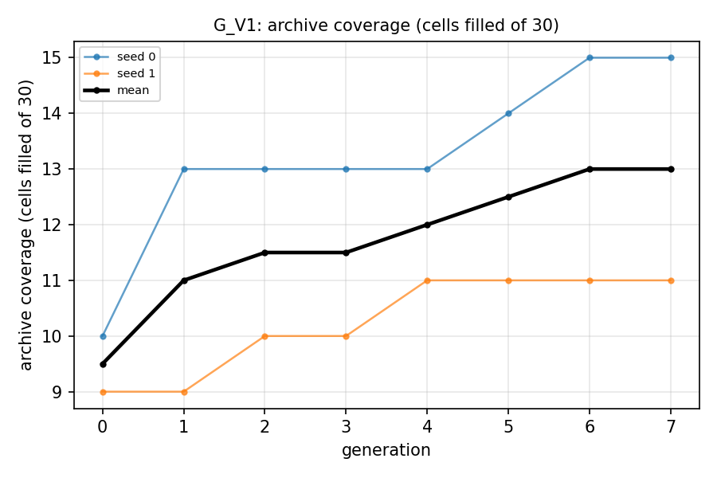

**QD-score**

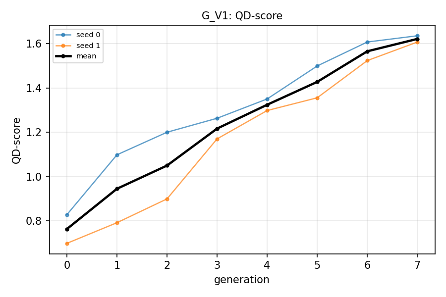

**Best and mean elite fitness**

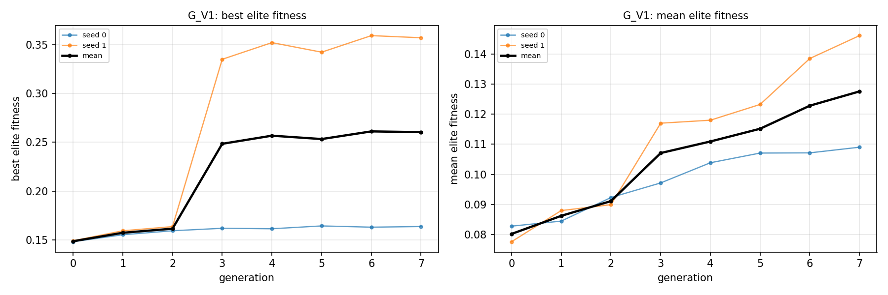

**Distinct founders and max founder share**

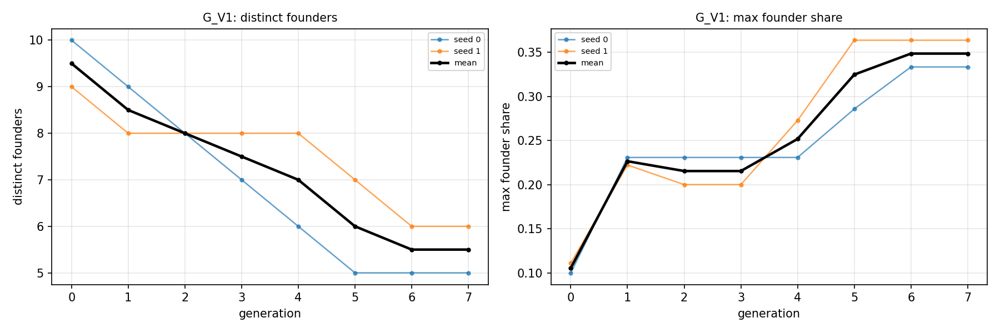

**Mean and max joint count of the elites**

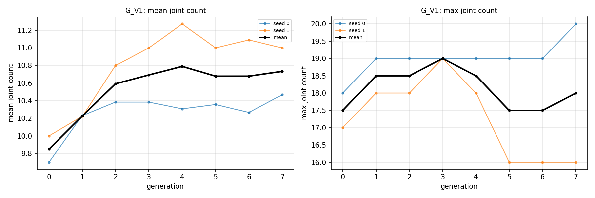

**Digit-count distribution of the elites**

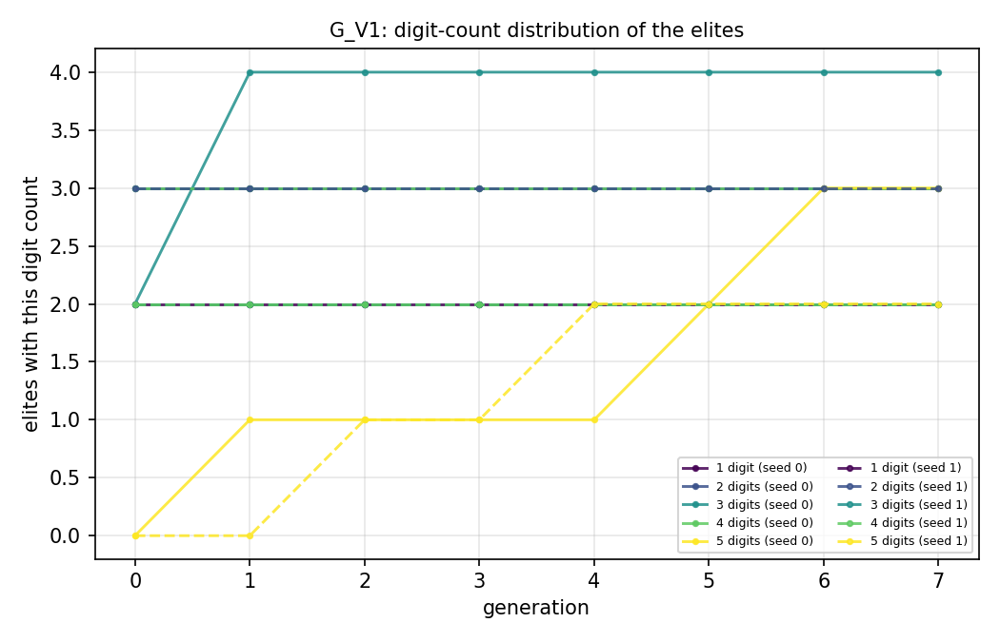

**Probe-hand fitness**

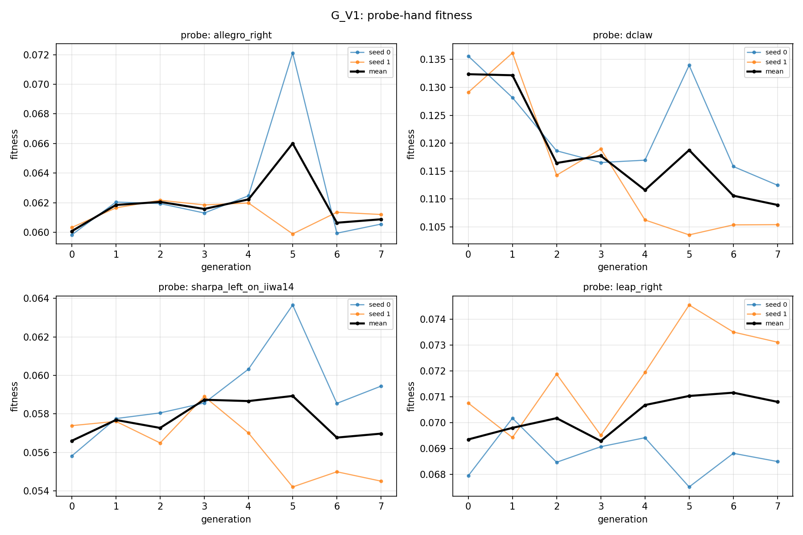

### Final-generation table

| metric | seed 0 | seed 1 | mean | range |
|---|---|---|---|---|
| final_generation | 7 | 7 | 7 | 0 |
| coverage | 15 | 11 | 13 | 4 |
| qd_score | 1.635 | 1.607 | 1.621 | 0.02841 |
| best_fitness | 0.1637 | 0.3571 | 0.2604 | 0.1934 |
| mean_fitness | 0.109 | 0.1461 | 0.1276 | 0.03707 |
| median_fitness | 0.1033 | 0.1053 | 0.1043 | 0.001937 |
| n_distinct_founders | 5 | 6 | 5.5 | 1 |
| max_founder_share | 0.3333 | 0.3636 | 0.3485 | 0.0303 |
| mean_joint_count | 10.47 | 11 | 10.73 | 0.5333 |
| max_joint_count | 20 | 16 | 18 | 4 |
| total_wall_time_h | 2.903 | 2.893 | 2.898 | 0.009916 |
| gpu_hours_approx | 2.903 | 2.893 | 2.898 | 0.009916 |
| probe_allegro_right_fitness | 0.06055 | 0.0612 | 0.06088 | 0.0006491 |
| probe_dclaw_fitness | 0.1125 | 0.1054 | 0.1089 | 0.007063 |
| probe_sharpa_left_on_iiwa14_fitness | 0.05944 | 0.05451 | 0.05698 | 0.004933 |
| probe_leap_right_fitness | 0.0685 | 0.07312 | 0.07081 | 0.004617 |

### Final archive occupancy (heatmap)

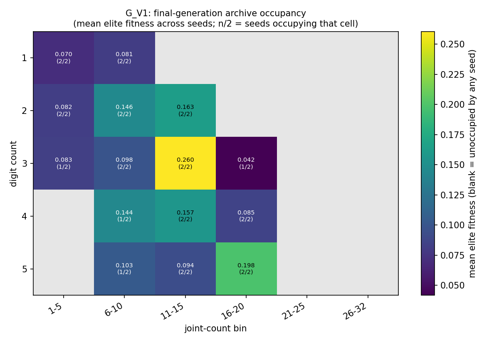

### Lineage (final archive)

**G_V1_s0** (seed 0)

| cell | design_id | founder_id | generation_born | depth (generations) | fitness |
|---|---|---|---|---|---|
| d1_j1-5 | gen7-off-000371 | gen0-founder-000012 | 7 | 5 | 0.06805 |
| d1_j6-10 | gen7-off-000374 | gen0-founder-000012 | 7 | 6 | 0.07312 |
| d2_j1-5 | gen3-off-000157 | gen0-founder-000034 | 3 | 2 | 0.08832 |
| d2_j11-15 | gen6-off-000303 | gen0-founder-000021 | 6 | 6 | 0.1588 |
| d2_j6-10 | gen7-off-000366 | gen0-founder-000021 | 7 | 7 | 0.1533 |
| d3_j1-5 | gen7-off-000356 | gen0-founder-000034 | 7 | 6 | 0.08294 |
| d3_j11-15 | gen7-off-000378 | gen0-founder-000021 | 7 | 5 | 0.1637 |
| d3_j16-20 | gen6-off-000326 | gen0-founder-000047 | 6 | 4 | 0.04168 |
| d3_j6-10 | gen6-off-000302 | gen0-founder-000043 | 6 | 5 | 0.1347 |
| d4_j11-15 | gen7-off-000375 | gen0-founder-000043 | 7 | 4 | 0.1565 |
| d4_j16-20 | gen7-off-000344 | gen0-founder-000047 | 7 | 4 | 0.06555 |
| d4_j6-10 | gen7-off-000352 | gen0-founder-000043 | 7 | 4 | 0.1438 |
| d5_j11-15 | gen6-off-000330 | gen0-founder-000043 | 6 | 4 | 0.1124 |
| d5_j16-20 | gen7-off-000360 | gen0-founder-000047 | 7 | 7 | 0.08926 |
| d5_j6-10 | gen7-off-000359 | gen0-founder-000043 | 7 | 5 | 0.1033 |

_Depth: mean 4.93, max 7, 0/15 elites are still their own founder (depth 0)._

**G_V1_s1** (seed 1)

| cell | design_id | founder_id | generation_born | depth (generations) | fitness |
|---|---|---|---|---|---|
| d1_j1-5 | gen6-off-000347 | gen0-founder-000013 | 6 | 4 | 0.07271 |
| d1_j6-10 | gen7-off-000383 | gen0-founder-000013 | 7 | 5 | 0.0894 |
| d2_j1-5 | gen6-off-000348 | gen0-founder-000037 | 6 | 5 | 0.07624 |
| d2_j11-15 | gen7-off-000369 | gen0-founder-000041 | 7 | 5 | 0.1675 |
| d2_j6-10 | gen7-off-000377 | gen0-founder-000041 | 7 | 5 | 0.138 |
| d3_j11-15 | gen7-off-000362 | gen0-founder-000014 | 7 | 5 | 0.3571 |
| d3_j6-10 | gen7-off-000373 | gen0-founder-000005 | 7 | 4 | 0.06206 |
| d4_j11-15 | gen7-off-000363 | gen0-founder-000045 | 7 | 6 | 0.157 |
| d4_j16-20 | gen7-off-000384 | gen0-founder-000045 | 7 | 6 | 0.1053 |
| d5_j11-15 | gen7-off-000408 | gen0-founder-000045 | 7 | 5 | 0.07474 |
| d5_j16-20 | gen7-off-000397 | gen0-founder-000045 | 7 | 6 | 0.307 |

_Depth: mean 5.09, max 6, 0/11 elites are still their own founder (depth 0)._

## Variant `G_V2S` (1 seed(s): [0])

### Per-generation curves

**Archive coverage (cells filled of 30)**

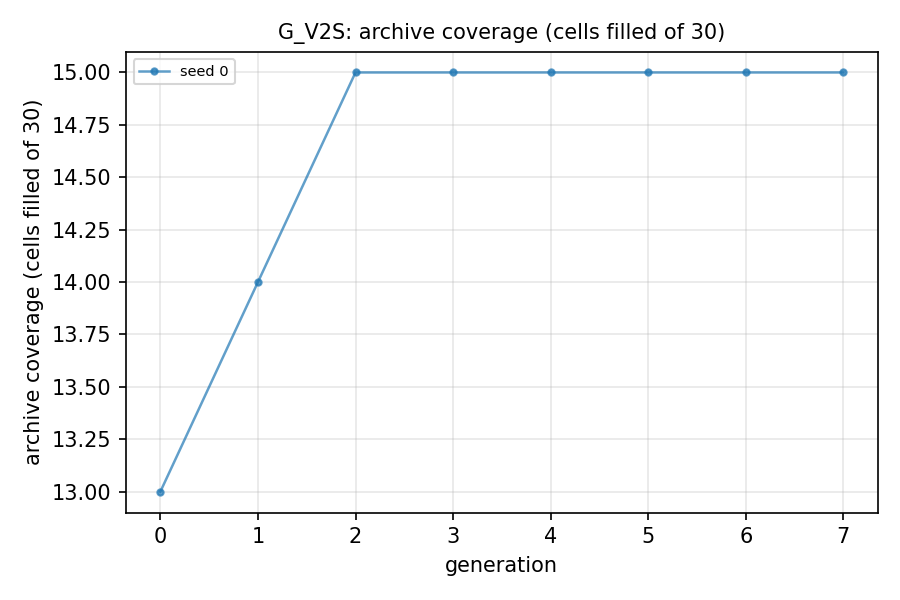

**QD-score**

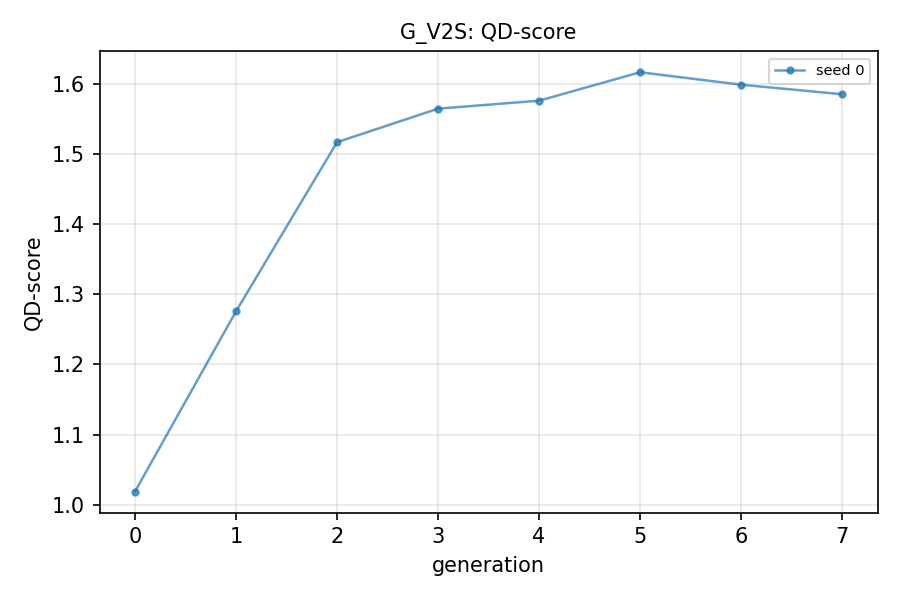

**Best and mean elite fitness**

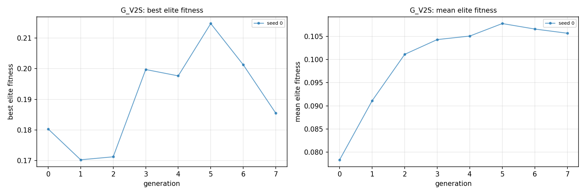

**Distinct founders and max founder share**

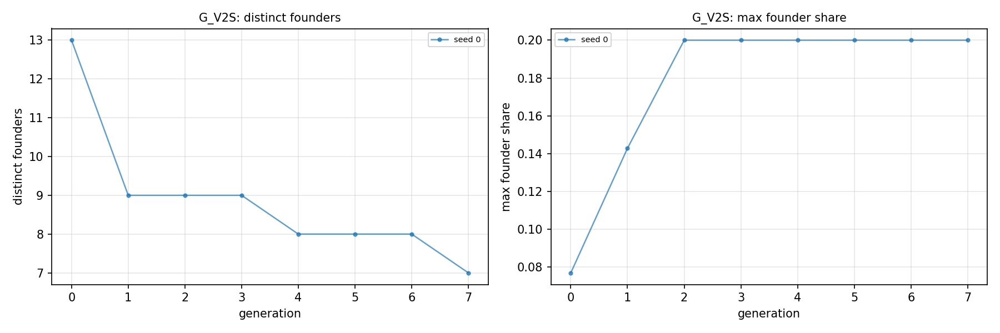

**Mean and max joint count of the elites**

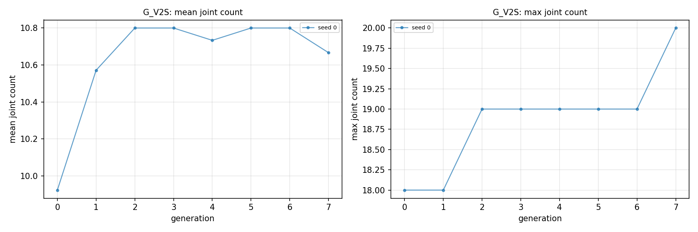

**Digit-count distribution of the elites**

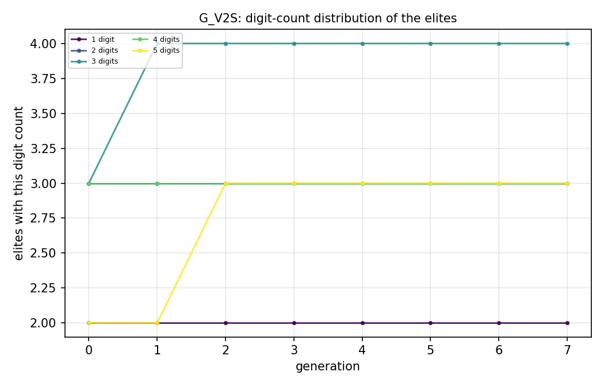

**Probe-hand fitness**

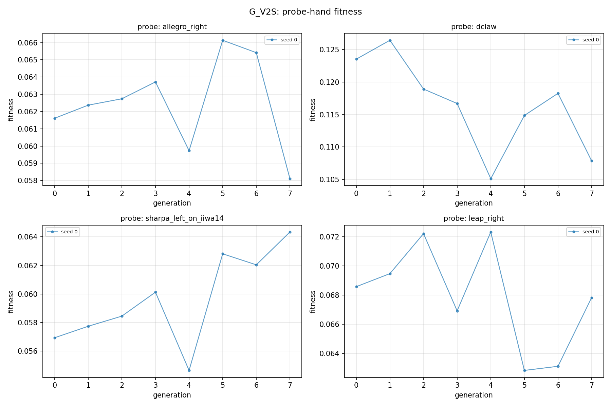

### Final-generation table

| metric | seed 0 | mean | range |
|---|---|---|---|
| final_generation | 7 | 7 | 0 |
| coverage | 15 | 15 | 0 |
| qd_score | 1.585 | 1.585 | 0 |
| best_fitness | 0.1855 | 0.1855 | 0 |
| mean_fitness | 0.1057 | 0.1057 | 0 |
| median_fitness | 0.08997 | 0.08997 | 0 |
| n_distinct_founders | 7 | 7 | 0 |
| max_founder_share | 0.2 | 0.2 | 0 |
| mean_joint_count | 10.67 | 10.67 | 0 |
| max_joint_count | 20 | 20 | 0 |
| total_wall_time_h | 1.326 | 1.326 | 0 |
| gpu_hours_approx | 1.326 | 1.326 | 0 |
| probe_allegro_right_fitness | 0.05811 | 0.05811 | 0 |
| probe_dclaw_fitness | 0.1079 | 0.1079 | 0 |
| probe_sharpa_left_on_iiwa14_fitness | 0.06434 | 0.06434 | 0 |
| probe_leap_right_fitness | 0.06782 | 0.06782 | 0 |

**Warning:** final generation possibly truncated/failed for: G_V2S_s0 (nonzero exit code or a single training window) -- treat that seed's final-generation numbers as low-confidence.

### Final archive occupancy (heatmap)

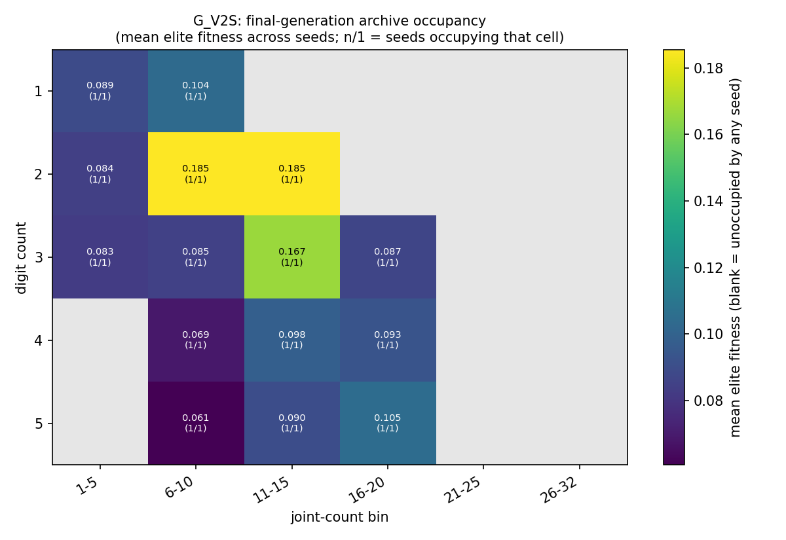

### Lineage (final archive)

**G_V2S_s0** (seed 0)

| cell | design_id | founder_id | generation_born | depth (generations) | fitness |
|---|---|---|---|---|---|
| d1_j1-5 | gen6-off-000293 | gen0-founder-000058 | 6 | 4 | 0.08908 |
| d1_j6-10 | gen7-off-000352 | gen0-founder-000058 | 7 | 5 | 0.1038 |
| d2_j1-5 | gen7-off-000350 | gen0-founder-000058 | 7 | 7 | 0.08424 |
| d2_j11-15 | gen7-off-000364 | gen0-founder-000010 | 7 | 5 | 0.1855 |
| d2_j6-10 | gen7-off-000333 | gen0-founder-000010 | 7 | 5 | 0.1851 |
| d3_j1-5 | gen6-off-000321 | gen0-founder-000039 | 6 | 6 | 0.08278 |
| d3_j11-15 | gen5-off-000275 | gen0-founder-000010 | 5 | 3 | 0.1669 |
| d3_j16-20 | gen7-off-000340 | gen0-founder-000052 | 7 | 4 | 0.08662 |
| d3_j6-10 | gen7-off-000367 | gen0-founder-000039 | 7 | 7 | 0.08496 |
| d4_j11-15 | gen6-off-000301 | gen0-founder-000043 | 6 | 3 | 0.09837 |
| d4_j16-20 | gen7-off-000354 | gen0-founder-000052 | 7 | 4 | 0.09336 |
| d4_j6-10 | gen7-off-000346 | gen0-founder-000013 | 7 | 6 | 0.06881 |
| d5_j11-15 | gen6-off-000298 | gen0-founder-000011 | 6 | 6 | 0.08997 |
| d5_j16-20 | gen7-off-000344 | gen0-founder-000011 | 7 | 4 | 0.105 |
| d5_j6-10 | gen7-off-000375 | gen0-founder-000013 | 7 | 6 | 0.06072 |

_Depth: mean 5.00, max 7, 0/15 elites are still their own founder (depth 0)._

## Variant `G_V3S` (2 seed(s): [0, 1])

### Per-generation curves

**Archive coverage (cells filled of 30)**

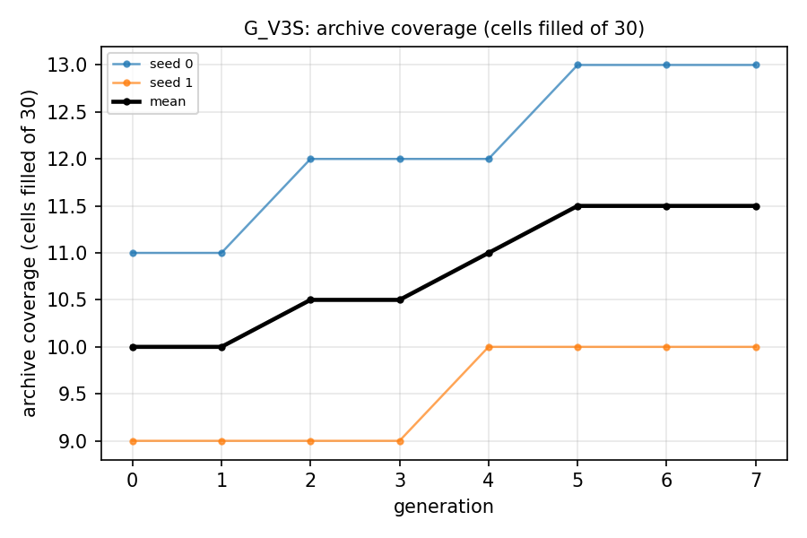

**QD-score**

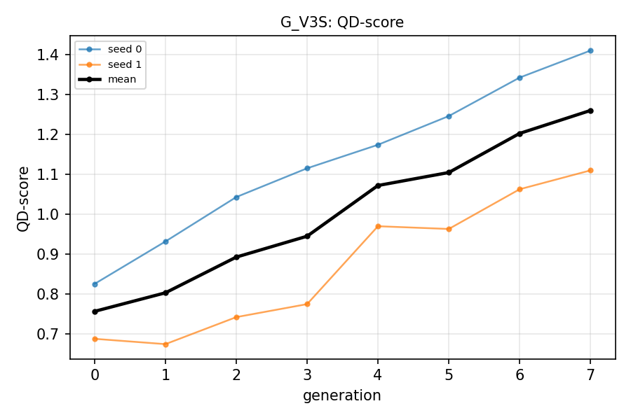

**Best and mean elite fitness**

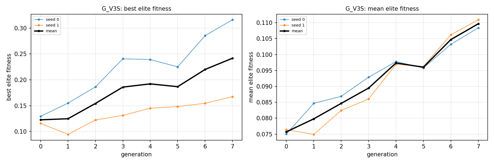

**Distinct founders and max founder share**

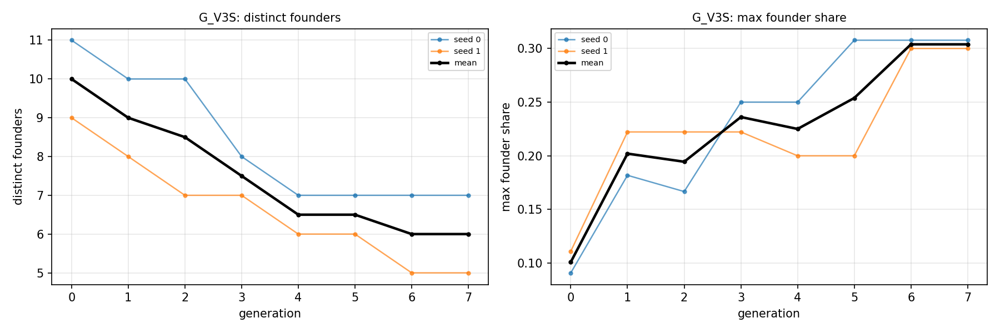

**Mean and max joint count of the elites**

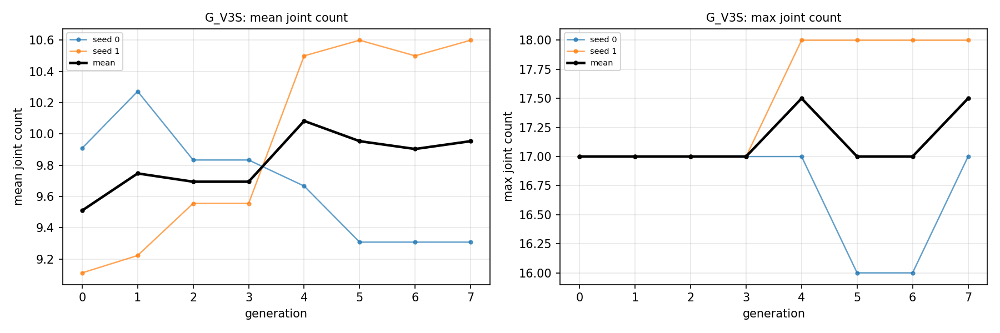

**Digit-count distribution of the elites**

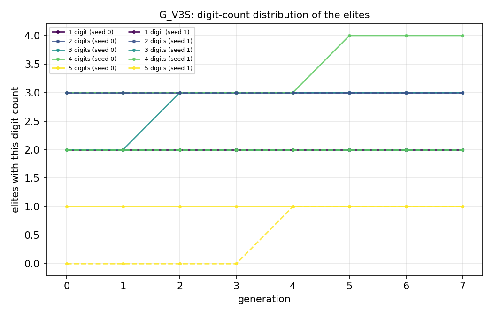

**Probe-hand fitness**

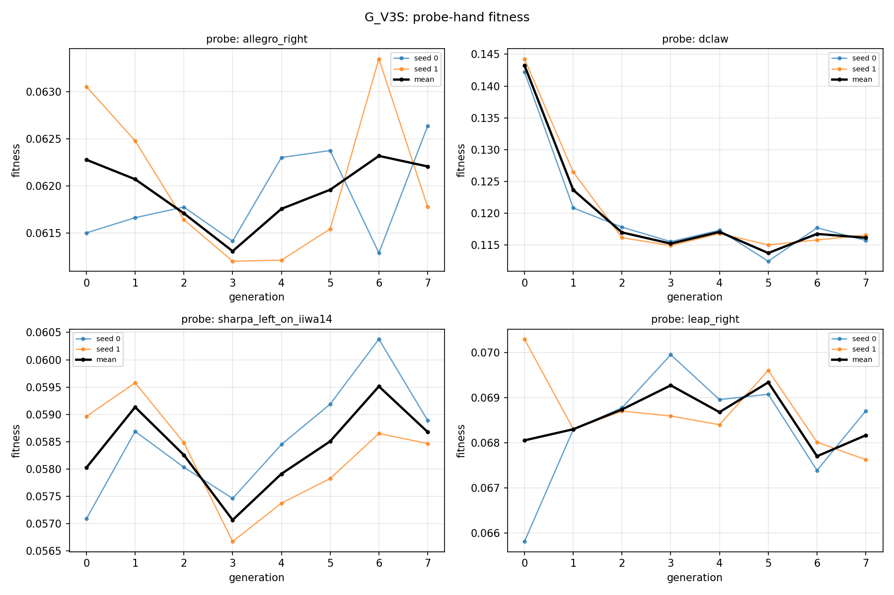

### Final-generation table

| metric | seed 0 | seed 1 | mean | range |
|---|---|---|---|---|
| final_generation | 7 | 7 | 7 | 0 |
| coverage | 13 | 10 | 11.5 | 3 |
| qd_score | 1.409 | 1.109 | 1.259 | 0.3 |
| best_fitness | 0.3159 | 0.1674 | 0.2416 | 0.1485 |
| mean_fitness | 0.1084 | 0.1109 | 0.1097 | 0.002519 |
| median_fitness | 0.09358 | 0.102 | 0.09779 | 0.008415 |
| n_distinct_founders | 7 | 5 | 6 | 2 |
| max_founder_share | 0.3077 | 0.3 | 0.3038 | 0.007692 |
| mean_joint_count | 9.308 | 10.6 | 9.954 | 1.292 |
| max_joint_count | 17 | 18 | 17.5 | 1 |
| total_wall_time_h | 2.94 | 2.96 | 2.95 | 0.01969 |
| gpu_hours_approx | 2.94 | 2.96 | 2.95 | 0.01969 |
| probe_allegro_right_fitness | 0.06264 | 0.06178 | 0.06221 | 0.0008573 |
| probe_dclaw_fitness | 0.1157 | 0.1166 | 0.1161 | 0.00084 |
| probe_sharpa_left_on_iiwa14_fitness | 0.05889 | 0.05847 | 0.05868 | 0.0004223 |
| probe_leap_right_fitness | 0.0687 | 0.06762 | 0.06816 | 0.001081 |

### Final archive occupancy (heatmap)

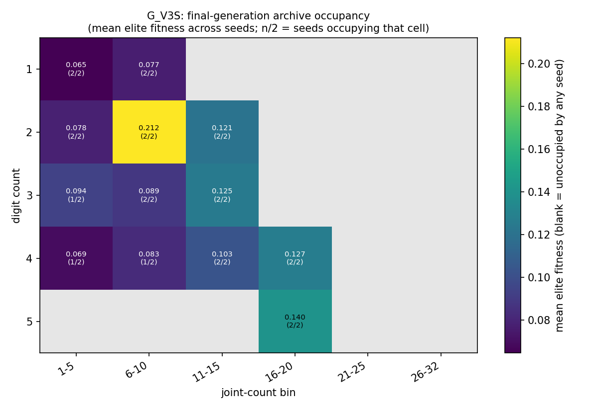

### Lineage (final archive)

**G_V3S_s0** (seed 0)

| cell | design_id | founder_id | generation_born | depth (generations) | fitness |
|---|---|---|---|---|---|
| d1_j1-5 | gen7-off-000356 | gen0-founder-000015 | 7 | 7 | 0.06549 |
| d1_j6-10 | gen4-off-000236 | gen0-founder-000015 | 4 | 4 | 0.0706 |
| d2_j1-5 | gen4-off-000248 | gen0-founder-000027 | 4 | 2 | 0.07557 |
| d2_j11-15 | gen7-off-000366 | gen0-founder-000000 | 7 | 5 | 0.1455 |
| d2_j6-10 | gen6-off-000336 | gen0-founder-000022 | 6 | 4 | 0.3159 |
| d3_j1-5 | gen7-off-000373 | gen0-founder-000027 | 7 | 5 | 0.09358 |
| d3_j11-15 | gen6-off-000304 | gen0-founder-000017 | 6 | 5 | 0.09737 |
| d3_j6-10 | gen5-off-000300 | gen0-founder-000027 | 5 | 3 | 0.06956 |
| d4_j1-5 | gen6-off-000321 | gen0-founder-000027 | 6 | 4 | 0.06929 |
| d4_j11-15 | gen7-off-000371 | gen0-founder-000009 | 7 | 5 | 0.113 |
| d4_j16-20 | gen6-off-000309 | gen0-founder-000017 | 6 | 3 | 0.09748 |
| d4_j6-10 | gen7-off-000372 | gen0-founder-000011 | 7 | 5 | 0.08287 |
| d5_j16-20 | gen7-off-000385 | gen0-founder-000009 | 7 | 5 | 0.1131 |

_Depth: mean 4.38, max 7, 0/13 elites are still their own founder (depth 0)._

**G_V3S_s1** (seed 1)

| cell | design_id | founder_id | generation_born | depth (generations) | fitness |
|---|---|---|---|---|---|
| d1_j1-5 | gen7-off-000397 | gen0-founder-000035 | 7 | 4 | 0.06368 |
| d1_j6-10 | gen3-off-000198 | gen0-founder-000035 | 3 | 3 | 0.08353 |
| d2_j1-5 | gen7-off-000411 | gen0-founder-000031 | 7 | 5 | 0.08045 |
| d2_j11-15 | gen7-off-000408 | gen0-founder-000010 | 7 | 6 | 0.09649 |
| d2_j6-10 | gen6-off-000333 | gen0-founder-000031 | 6 | 4 | 0.1085 |
| d3_j11-15 | gen7-off-000365 | gen0-founder-000057 | 7 | 6 | 0.1521 |
| d3_j6-10 | gen7-off-000379 | gen0-founder-000057 | 7 | 6 | 0.1075 |
| d4_j11-15 | gen7-off-000405 | gen0-founder-000057 | 7 | 6 | 0.0931 |
| d4_j16-20 | gen7-off-000410 | gen0-founder-000016 | 7 | 5 | 0.1565 |
| d5_j16-20 | gen7-off-000383 | gen0-founder-000016 | 7 | 7 | 0.1674 |

_Depth: mean 5.20, max 7, 0/10 elites are still their own founder (depth 0)._
