# Evolution pilot analysis

Generated 2026-10-01T19:52:58+00:00Z by `experiments/evolution_pilot/analyze_pilot.py`.

Run directories analyzed:
- `outputs/evolution_pilot/cluster_pilot2/G_V1_s0`
- `outputs/evolution_pilot/cluster_pilot2/G_V1_s1`
- `outputs/evolution_pilot/pilot2/G_V1_s2`
- `outputs/evolution_pilot/cluster_pilot2/G_V3S_s0`
- `outputs/evolution_pilot/cluster_pilot2/G_V3S_s1`
- `outputs/evolution_pilot/pilot2/G_V3S_s2`

**Honest statistics.** Variants here have at most 2 seeds. Every per-variant number below is reported as the per-seed values, their mean, and their range (max - min) -- never a standard error, a confidence interval, or a significance claim. With n=2, a range is all the data supports.

## Variant `G_V1` (3 seed(s): [0, 1, 2])

### Per-generation curves

**Archive coverage (cells filled of 30)**

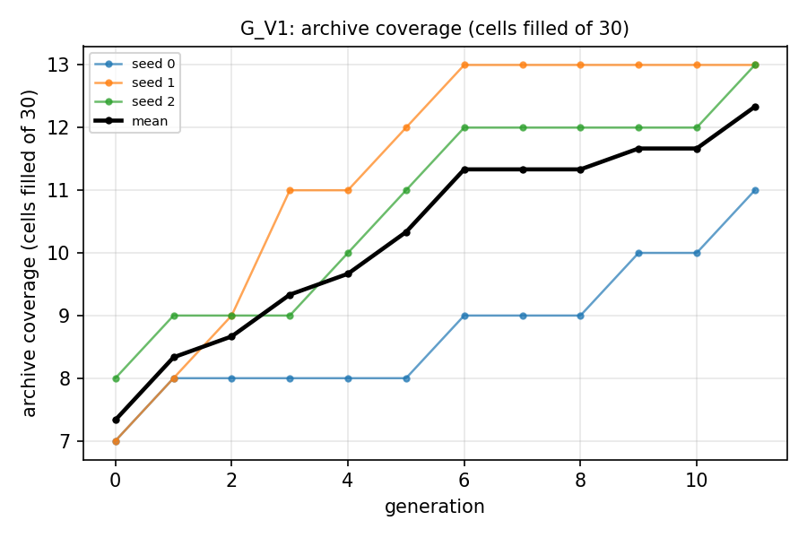

**QD-score**

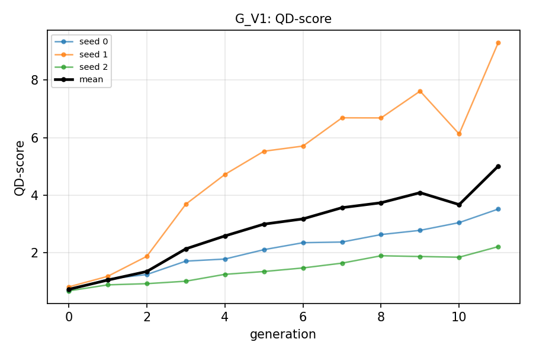

**Best and mean elite fitness**

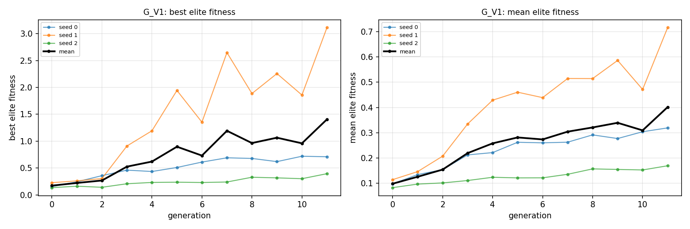

**Distinct founders and max founder share**

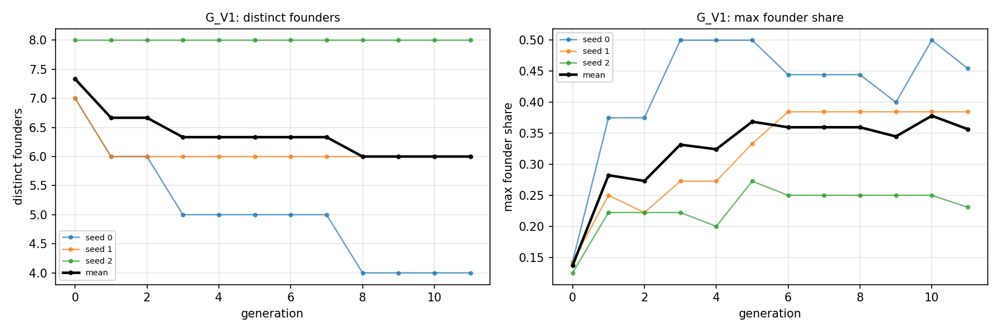

**Mean and max joint count of the elites**

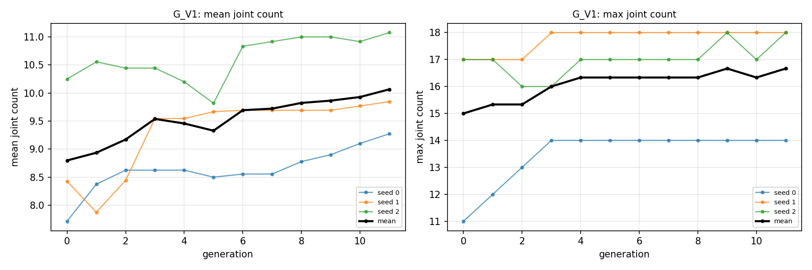

**Digit-count distribution of the elites**

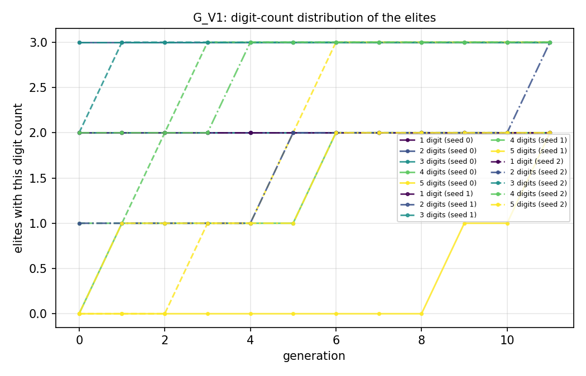

**Probe-hand fitness**

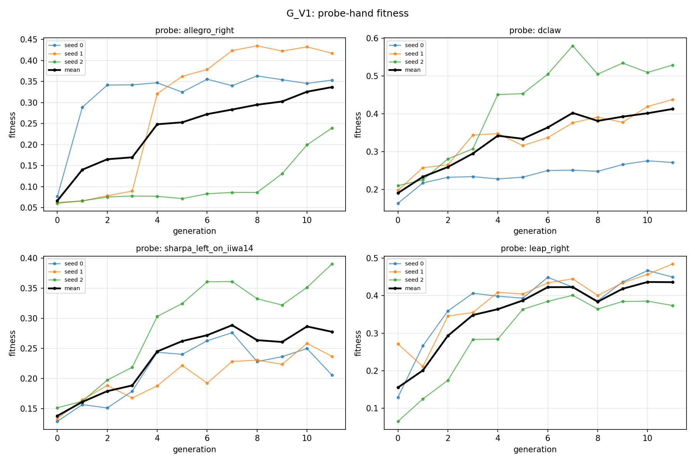

### Final-generation table

| metric | seed 0 | seed 1 | seed 2 | mean | range |
|---|---|---|---|---|---|
| final_generation | 11 | 11 | 11 | 11 | 0 |
| coverage | 11 | 13 | 13 | 12.33 | 2 |
| qd_score | 3.512 | 9.299 | 2.204 | 5.005 | 7.095 |
| best_fitness | 0.7096 | 3.112 | 0.3943 | 1.405 | 2.717 |
| mean_fitness | 0.3192 | 0.7153 | 0.1696 | 0.4014 | 0.5458 |
| median_fitness | 0.2374 | 0.3494 | 0.1631 | 0.25 | 0.1863 |
| n_distinct_founders | 4 | 6 | 8 | 6 | 4 |
| max_founder_share | 0.4545 | 0.3846 | 0.2308 | 0.3566 | 0.2238 |
| mean_joint_count | 9.273 | 9.846 | 11.08 | 10.07 | 1.804 |
| max_joint_count | 14 | 18 | 18 | 16.67 | 4 |
| total_wall_time_h | 5.545 | 5.55 | 2.843 | 4.646 | 2.706 |
| gpu_hours_approx | 5.545 | 5.55 | 2.843 | 4.646 | 2.706 |
| probe_allegro_right_fitness | 0.3532 | 0.4169 | 0.2394 | 0.3365 | 0.1775 |
| probe_dclaw_fitness | 0.2715 | 0.4383 | 0.5295 | 0.4131 | 0.258 |
| probe_sharpa_left_on_iiwa14_fitness | 0.2056 | 0.2369 | 0.3906 | 0.2777 | 0.1849 |
| probe_leap_right_fitness | 0.4498 | 0.4849 | 0.3739 | 0.4362 | 0.111 |

### Final archive occupancy (heatmap)

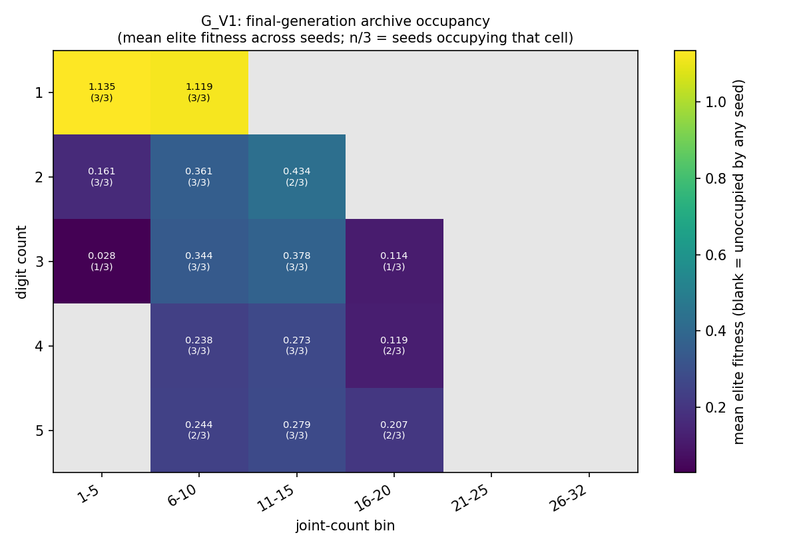

### Lineage (final archive)

**G_V1_s0** (seed 0)

| cell | design_id | founder_id | generation_born | depth (generations) | fitness |
|---|---|---|---|---|---|
| d1_j1-5 | gen9-off-000204 | gen0-founder-000011 | 9 | 7 | 0.1304 |
| d1_j6-10 | gen11-off-000232 | gen0-founder-000011 | 11 | 8 | 0.1395 |
| d2_j1-5 | gen10-off-000209 | gen0-founder-000015 | 10 | 6 | 0.0708 |
| d2_j11-15 | gen11-off-000226 | gen0-founder-000013 | 11 | 7 | 0.7096 |
| d2_j6-10 | gen11-off-000241 | gen0-founder-000013 | 11 | 7 | 0.5094 |
| d3_j11-15 | gen11-off-000230 | gen0-founder-000013 | 11 | 4 | 0.611 |
| d3_j6-10 | gen11-off-000239 | gen0-founder-000013 | 11 | 7 | 0.4755 |
| d4_j11-15 | gen7-off-000155 | gen0-founder-000013 | 7 | 7 | 0.2374 |
| d4_j6-10 | gen8-off-000173 | gen0-founder-000004 | 8 | 4 | 0.212 |
| d5_j11-15 | gen11-off-000227 | gen0-founder-000004 | 11 | 6 | 0.2539 |
| d5_j6-10 | gen9-off-000191 | gen0-founder-000004 | 9 | 5 | 0.1621 |

_Depth: mean 6.18, max 8, 0/11 elites are still their own founder (depth 0)._

**G_V1_s1** (seed 1)

| cell | design_id | founder_id | generation_born | depth (generations) | fitness |
|---|---|---|---|---|---|
| d1_j1-5 | gen11-off-000209 | gen0-founder-000010 | 11 | 3 | 3.112 |
| d1_j6-10 | gen11-off-000208 | gen0-founder-000010 | 11 | 3 | 2.823 |
| d2_j1-5 | gen8-off-000158 | gen0-founder-000019 | 8 | 4 | 0.3664 |
| d2_j6-10 | gen10-off-000183 | gen0-founder-000019 | 10 | 5 | 0.413 |
| d3_j1-5 | gen11-off-000199 | gen0-founder-000022 | 11 | 4 | 0.02833 |
| d3_j11-15 | gen8-off-000160 | gen0-founder-000014 | 8 | 3 | 0.2703 |
| d3_j6-10 | gen11-off-000205 | gen0-founder-000015 | 11 | 6 | 0.3402 |
| d4_j11-15 | gen2-off-000061 | gen0-founder-000015 | 2 | 1 | 0.3632 |
| d4_j16-20 | gen3-off-000074 | gen0-founder-000012 | 3 | 3 | 0.1935 |
| d4_j6-10 | gen8-off-000167 | gen0-founder-000015 | 8 | 5 | 0.3341 |
| d5_j11-15 | gen11-off-000212 | gen0-founder-000015 | 11 | 8 | 0.3797 |
| d5_j16-20 | gen11-off-000198 | gen0-founder-000012 | 11 | 6 | 0.3494 |
| d5_j6-10 | gen11-off-000206 | gen0-founder-000015 | 11 | 6 | 0.3261 |

_Depth: mean 4.38, max 8, 0/13 elites are still their own founder (depth 0)._

**G_V1_s2** (seed 2)

| cell | design_id | founder_id | generation_born | depth (generations) | fitness |
|---|---|---|---|---|---|
| d1_j1-5 | gen10-off-000200 | gen0-founder-000008 | 10 | 4 | 0.1631 |
| d1_j6-10 | gen8-off-000163 | gen0-founder-000006 | 8 | 5 | 0.3943 |
| d2_j1-5 | gen10-off-000203 | gen0-founder-000026 | 10 | 8 | 0.04718 |
| d2_j11-15 | gen11-off-000212 | gen0-founder-000003 | 11 | 6 | 0.1581 |
| d2_j6-10 | gen10-off-000201 | gen0-founder-000003 | 10 | 5 | 0.1601 |
| d3_j11-15 | gen11-off-000215 | gen0-founder-000014 | 11 | 8 | 0.2532 |
| d3_j16-20 | gen10-off-000189 | gen0-founder-000004 | 10 | 4 | 0.1137 |
| d3_j6-10 | gen9-off-000182 | gen0-founder-000014 | 9 | 5 | 0.2157 |
| d4_j11-15 | gen9-off-000180 | gen0-founder-000014 | 9 | 7 | 0.2176 |
| d4_j16-20 | gen10-off-000198 | gen0-founder-000025 | 10 | 4 | 0.04537 |
| d4_j6-10 | gen4-off-000090 | gen0-founder-000026 | 4 | 4 | 0.1685 |
| d5_j11-15 | gen8-off-000164 | gen0-founder-000020 | 8 | 4 | 0.2034 |
| d5_j16-20 | gen11-off-000210 | gen0-founder-000025 | 11 | 9 | 0.06391 |

_Depth: mean 5.62, max 9, 0/13 elites are still their own founder (depth 0)._

## Variant `G_V3S` (3 seed(s): [0, 1, 2])

### Per-generation curves

**Archive coverage (cells filled of 30)**

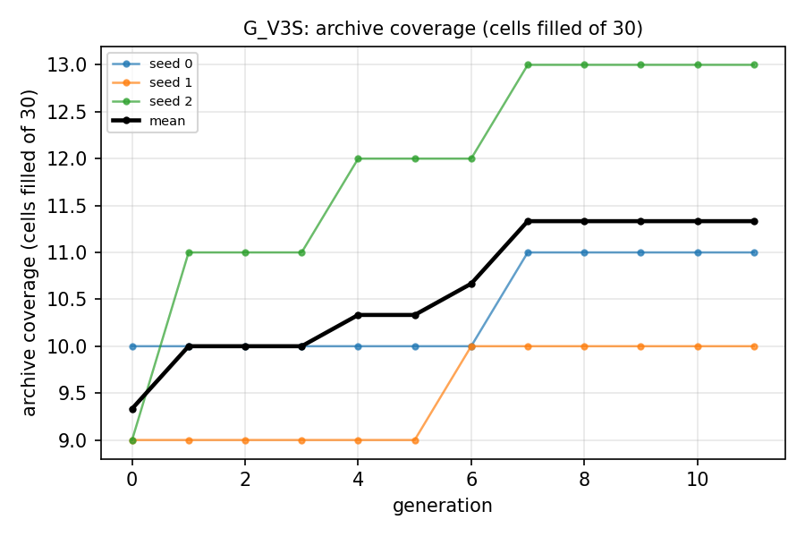

**QD-score**

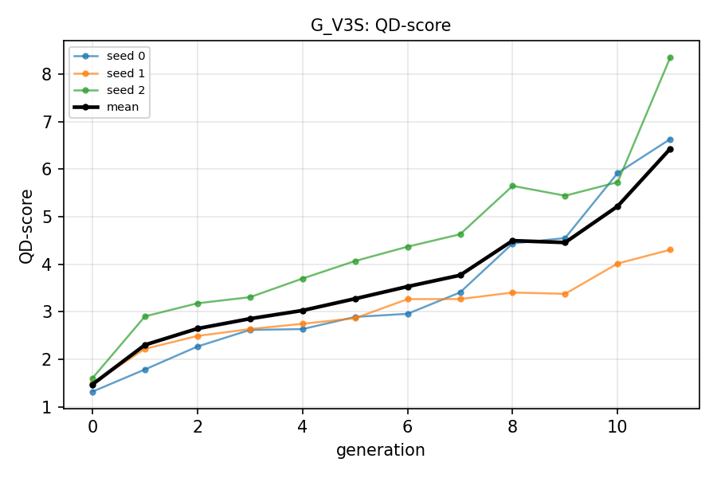

**Best and mean elite fitness**

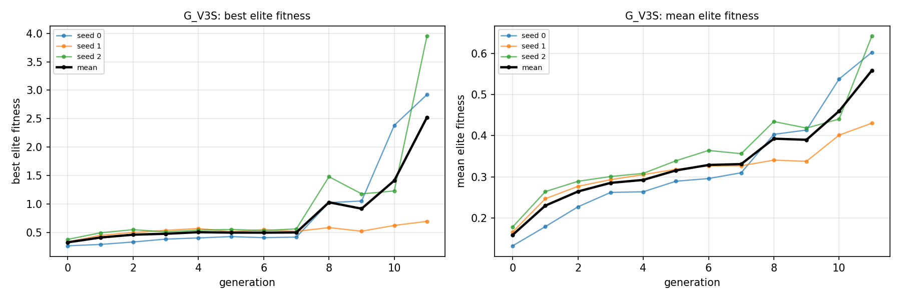

**Distinct founders and max founder share**

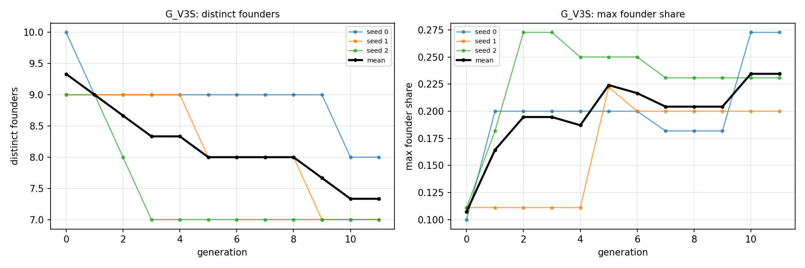

**Mean and max joint count of the elites**

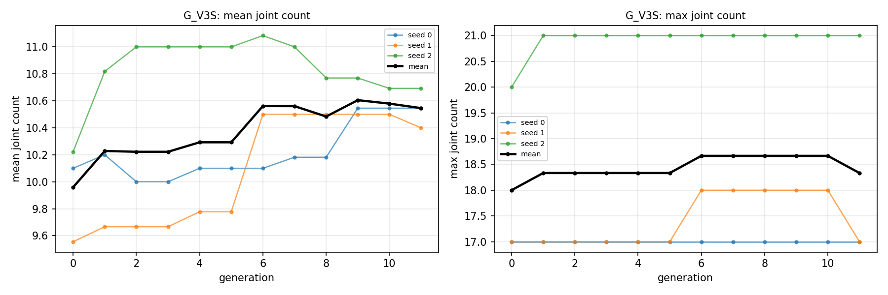

**Digit-count distribution of the elites**

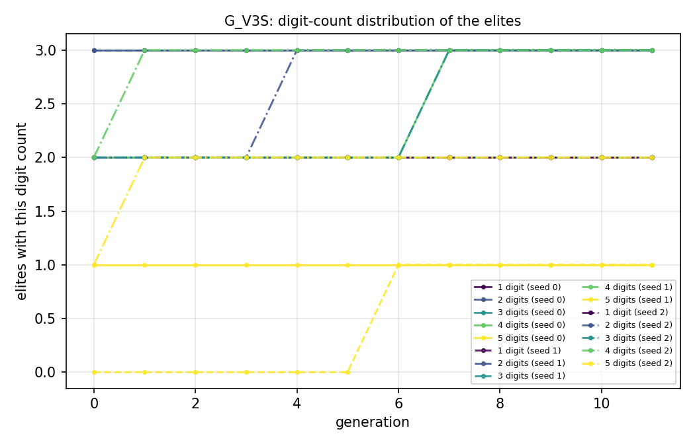

**Probe-hand fitness**

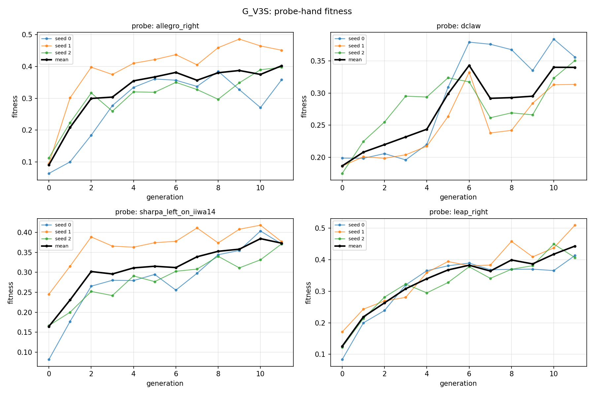

### Final-generation table

| metric | seed 0 | seed 1 | seed 2 | mean | range |
|---|---|---|---|---|---|
| final_generation | 11 | 11 | 11 | 11 | 0 |
| coverage | 11 | 10 | 13 | 11.33 | 3 |
| qd_score | 6.634 | 4.306 | 8.35 | 6.43 | 4.044 |
| best_fitness | 2.922 | 0.6956 | 3.949 | 2.522 | 3.253 |
| mean_fitness | 0.6031 | 0.4306 | 0.6423 | 0.5587 | 0.2117 |
| median_fitness | 0.422 | 0.4446 | 0.3939 | 0.4202 | 0.0507 |
| n_distinct_founders | 8 | 7 | 7 | 7.333 | 1 |
| max_founder_share | 0.2727 | 0.2 | 0.2308 | 0.2345 | 0.07273 |
| mean_joint_count | 10.55 | 10.4 | 10.69 | 10.55 | 0.2923 |
| max_joint_count | 17 | 17 | 21 | 18.33 | 4 |
| total_wall_time_h | 5.557 | 5.636 | 2.893 | 4.695 | 2.742 |
| gpu_hours_approx | 5.557 | 5.636 | 2.893 | 4.695 | 2.742 |
| probe_allegro_right_fitness | 0.3584 | 0.451 | 0.3976 | 0.4023 | 0.09265 |
| probe_dclaw_fitness | 0.3557 | 0.3133 | 0.3504 | 0.3398 | 0.04237 |
| probe_sharpa_left_on_iiwa14_fitness | 0.371 | 0.3766 | 0.3713 | 0.373 | 0.005611 |
| probe_leap_right_fitness | 0.4135 | 0.5098 | 0.407 | 0.4434 | 0.1028 |

### Final archive occupancy (heatmap)

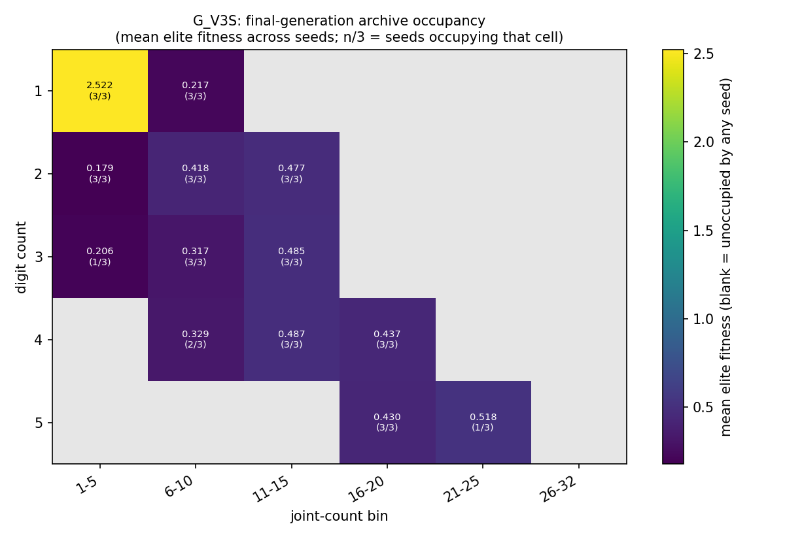

### Lineage (final archive)

**G_V3S_s0** (seed 0)

| cell | design_id | founder_id | generation_born | depth (generations) | fitness |
|---|---|---|---|---|---|
| d1_j1-5 | gen10-off-000201 | gen0-founder-000020 | 10 | 4 | 2.922 |
| d1_j6-10 | gen11-off-000220 | gen0-founder-000015 | 11 | 2 | 0.1431 |
| d2_j1-5 | gen11-off-000214 | gen0-founder-000020 | 11 | 5 | 0.2088 |
| d2_j11-15 | gen9-off-000171 | gen0-founder-000000 | 9 | 3 | 0.422 |
| d2_j6-10 | gen4-off-000091 | gen0-founder-000022 | 4 | 3 | 0.4399 |
| d3_j11-15 | gen9-off-000184 | gen0-founder-000017 | 9 | 5 | 0.3774 |
| d3_j6-10 | gen8-off-000167 | gen0-founder-000021 | 8 | 2 | 0.2915 |
| d4_j11-15 | gen10-off-000197 | gen0-founder-000006 | 10 | 4 | 0.4825 |
| d4_j16-20 | gen7-off-000145 | gen0-founder-000006 | 7 | 2 | 0.5123 |
| d4_j6-10 | gen6-off-000133 | gen0-founder-000011 | 6 | 5 | 0.3558 |
| d5_j16-20 | gen11-off-000219 | gen0-founder-000006 | 11 | 4 | 0.4784 |

_Depth: mean 3.55, max 5, 0/11 elites are still their own founder (depth 0)._

**G_V3S_s1** (seed 1)

| cell | design_id | founder_id | generation_born | depth (generations) | fitness |
|---|---|---|---|---|---|
| d1_j1-5 | gen10-off-000207 | gen0-founder-000024 | 10 | 3 | 0.6956 |
| d1_j6-10 | gen11-off-000223 | gen0-founder-000004 | 11 | 5 | 0.114 |
| d2_j1-5 | gen7-off-000142 | gen0-founder-000025 | 7 | 4 | 0.2569 |
| d2_j11-15 | gen11-off-000214 | gen0-founder-000010 | 11 | 6 | 0.6598 |
| d2_j6-10 | gen11-off-000225 | gen0-founder-000027 | 11 | 4 | 0.4513 |
| d3_j11-15 | gen11-off-000215 | gen0-founder-000023 | 11 | 5 | 0.6222 |
| d3_j6-10 | gen9-off-000195 | gen0-founder-000027 | 9 | 3 | 0.438 |
| d4_j11-15 | gen9-off-000194 | gen0-founder-000023 | 9 | 4 | 0.502 |
| d4_j16-20 | gen9-off-000190 | gen0-founder-000016 | 9 | 5 | 0.2737 |
| d5_j16-20 | gen11-off-000227 | gen0-founder-000016 | 11 | 7 | 0.2925 |

_Depth: mean 4.60, max 7, 0/10 elites are still their own founder (depth 0)._

**G_V3S_s2** (seed 2)

| cell | design_id | founder_id | generation_born | depth (generations) | fitness |
|---|---|---|---|---|---|
| d1_j1-5 | gen11-off-000193 | gen0-founder-000006 | 11 | 5 | 3.949 |
| d1_j6-10 | gen6-off-000127 | gen0-founder-000010 | 6 | 2 | 0.3939 |
| d2_j1-5 | gen3-off-000078 | gen0-founder-000015 | 3 | 2 | 0.07096 |
| d2_j11-15 | gen11-off-000194 | gen0-founder-000016 | 11 | 6 | 0.3495 |
| d2_j6-10 | gen2-off-000051 | gen0-founder-000016 | 2 | 2 | 0.3629 |
| d3_j1-5 | gen9-off-000168 | gen0-founder-000007 | 9 | 3 | 0.2058 |
| d3_j11-15 | gen11-off-000200 | gen0-founder-000003 | 11 | 3 | 0.4546 |
| d3_j6-10 | gen9-off-000169 | gen0-founder-000007 | 9 | 4 | 0.2207 |
| d4_j11-15 | gen10-off-000183 | gen0-founder-000003 | 10 | 3 | 0.4768 |
| d4_j16-20 | gen7-off-000135 | gen0-founder-000023 | 7 | 2 | 0.5265 |
| d4_j6-10 | gen11-off-000195 | gen0-founder-000007 | 11 | 6 | 0.3024 |
| d5_j16-20 | gen7-off-000141 | gen0-founder-000023 | 7 | 5 | 0.519 |
| d5_j21-25 | gen10-off-000186 | gen0-founder-000023 | 10 | 6 | 0.5182 |

_Depth: mean 3.77, max 6, 0/13 elites are still their own founder (depth 0)._
