# Evolution pilot analysis

Generated 2026-10-02T09:12:23+00:00Z by `experiments/evolution_pilot/analyze_pilot.py`.

Run directories analyzed:
- `outputs/evolution_pilot/cluster_pilot3/G_V1_s0`
- `outputs/evolution_pilot/cluster_pilot3/G_V1_s1`
- `outputs/evolution_pilot/pilot2/G_V1_s2`
- `outputs/evolution_pilot/cluster_pilot3/G_V3S_s0`
- `outputs/evolution_pilot/cluster_pilot3/G_V3S_s1`
- `outputs/evolution_pilot/cluster_pilot3/G_V2S_s0`
- `outputs/evolution_pilot/cluster_pilot3/G_V2S_s1`
- `outputs/evolution_pilot/cluster_pilot3/G_V2S_s2`
- `outputs/evolution_pilot/cluster_pilot3/G_V2S_s3`

**Honest statistics.** Variants here have at most 2 seeds. Every per-variant number below is reported as the per-seed values, their mean, and their range (max - min) -- never a standard error, a confidence interval, or a significance claim. With n=2, a range is all the data supports.

## Variant `G_V1` (3 seed(s): [0, 1, 2])

### Per-generation curves

**Archive coverage (cells filled of 30)**

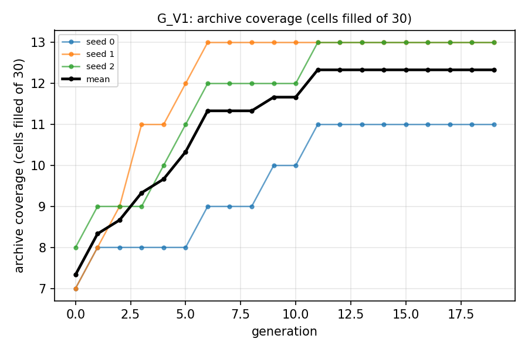

**QD-score**

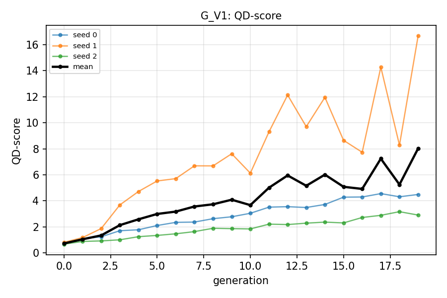

**Best and mean elite fitness**

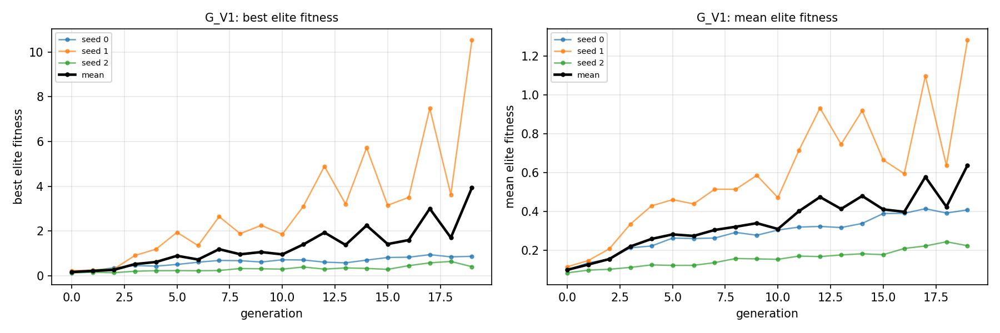

**Distinct founders and max founder share**

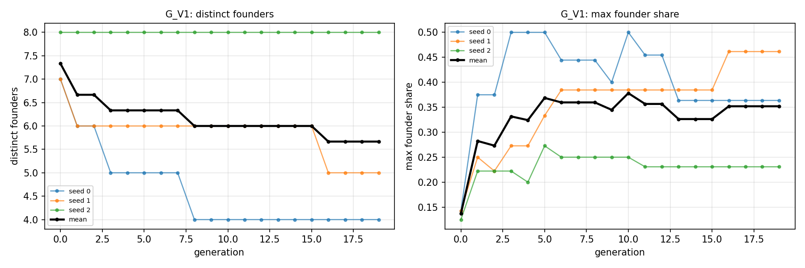

**Mean and max joint count of the elites**

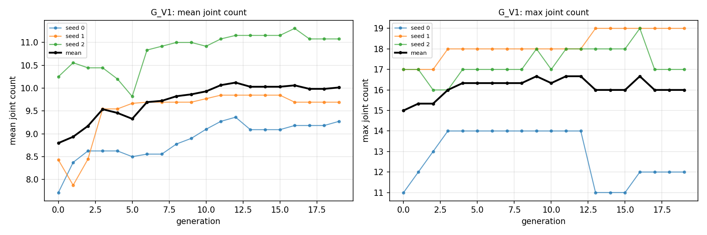

**Digit-count distribution of the elites**

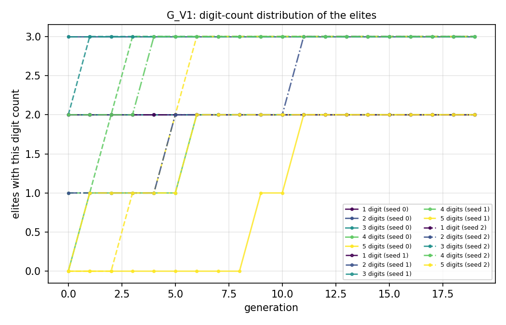

**Probe-hand fitness**

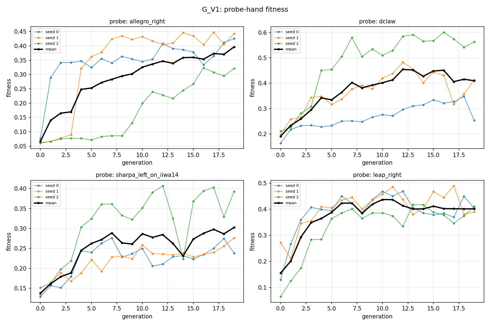

### Final-generation table

| metric | seed 0 | seed 1 | seed 2 | mean | range |
|---|---|---|---|---|---|
| final_generation | 19 | 19 | 19 | 19 | 0 |
| coverage | 11 | 13 | 13 | 12.33 | 2 |
| qd_score | 4.487 | 16.68 | 2.901 | 8.022 | 13.78 |
| best_fitness | 0.873 | 10.53 | 0.4102 | 3.937 | 10.12 |
| mean_fitness | 0.4079 | 1.283 | 0.2232 | 0.638 | 1.06 |
| median_fitness | 0.324 | 0.3607 | 0.1978 | 0.2942 | 0.1629 |
| n_distinct_founders | 4 | 5 | 8 | 5.667 | 4 |
| max_founder_share | 0.3636 | 0.4615 | 0.2308 | 0.352 | 0.2308 |
| mean_joint_count | 9.273 | 9.692 | 11.08 | 10.01 | 1.804 |
| max_joint_count | 12 | 19 | 17 | 16 | 7 |
| total_wall_time_h | 9.271 | 9.265 | 4.746 | 7.761 | 4.526 |
| gpu_hours_approx | 9.271 | 9.265 | 4.746 | 7.761 | 4.526 |
| probe_allegro_right_fitness | 0.4254 | 0.4424 | 0.3212 | 0.3964 | 0.1212 |
| probe_dclaw_fitness | 0.2531 | 0.4135 | 0.563 | 0.4098 | 0.3099 |
| probe_sharpa_left_on_iiwa14_fitness | 0.2382 | 0.2762 | 0.3926 | 0.3023 | 0.1544 |
| probe_leap_right_fitness | 0.4032 | 0.3894 | 0.4105 | 0.401 | 0.02117 |

### Final archive occupancy (heatmap)

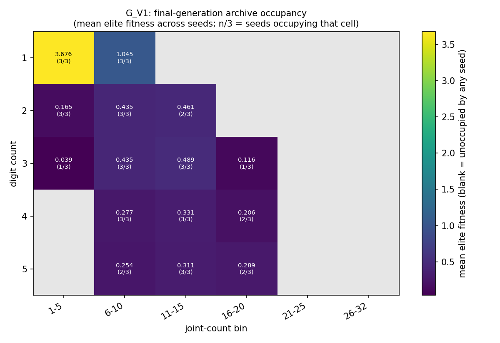

### Lineage (final archive)

**G_V1_s0** (seed 0)

| cell | design_id | founder_id | generation_born | depth (generations) | fitness |
|---|---|---|---|---|---|
| d1_j1-5 | gen18-off-000348 | gen0-founder-000011 | 18 | 12 | 0.1366 |
| d1_j6-10 | gen15-off-000304 | gen0-founder-000011 | 15 | 12 | 0.1311 |
| d2_j1-5 | gen18-off-000345 | gen0-founder-000015 | 18 | 8 | 0.08213 |
| d2_j11-15 | gen15-off-000309 | gen0-founder-000013 | 15 | 9 | 0.7646 |
| d2_j6-10 | gen19-off-000362 | gen0-founder-000013 | 19 | 9 | 0.744 |
| d3_j11-15 | gen16-off-000324 | gen0-founder-000013 | 16 | 7 | 0.873 |
| d3_j6-10 | gen18-off-000346 | gen0-founder-000013 | 18 | 9 | 0.6559 |
| d4_j11-15 | gen17-off-000337 | gen0-founder-000004 | 17 | 8 | 0.2901 |
| d4_j6-10 | gen17-off-000329 | gen0-founder-000004 | 17 | 8 | 0.324 |
| d5_j11-15 | gen19-off-000373 | gen0-founder-000004 | 19 | 9 | 0.3254 |
| d5_j6-10 | gen18-off-000359 | gen0-founder-000004 | 18 | 6 | 0.1602 |

_Depth: mean 8.82, max 12, 0/11 elites are still their own founder (depth 0)._

**G_V1_s1** (seed 1)

| cell | design_id | founder_id | generation_born | depth (generations) | fitness |
|---|---|---|---|---|---|
| d1_j1-5 | gen18-off-000303 | gen0-founder-000010 | 18 | 6 | 10.53 |
| d1_j6-10 | gen18-off-000312 | gen0-founder-000010 | 18 | 5 | 2.594 |
| d2_j1-5 | gen19-off-000319 | gen0-founder-000019 | 19 | 9 | 0.3607 |
| d2_j6-10 | gen18-off-000310 | gen0-founder-000019 | 18 | 8 | 0.4009 |
| d3_j1-5 | gen16-off-000275 | gen0-founder-000022 | 16 | 6 | 0.03924 |
| d3_j11-15 | gen16-off-000273 | gen0-founder-000015 | 16 | 10 | 0.314 |
| d3_j6-10 | gen17-off-000292 | gen0-founder-000015 | 17 | 10 | 0.359 |
| d4_j11-15 | gen19-off-000323 | gen0-founder-000015 | 19 | 4 | 0.4289 |
| d4_j16-20 | gen18-off-000313 | gen0-founder-000012 | 18 | 6 | 0.2132 |
| d4_j6-10 | gen8-off-000167 | gen0-founder-000015 | 8 | 5 | 0.3167 |
| d5_j11-15 | gen19-off-000325 | gen0-founder-000015 | 19 | 11 | 0.4093 |
| d5_j16-20 | gen19-off-000328 | gen0-founder-000012 | 19 | 9 | 0.3658 |
| d5_j6-10 | gen19-off-000330 | gen0-founder-000015 | 19 | 10 | 0.3478 |

_Depth: mean 7.62, max 11, 0/13 elites are still their own founder (depth 0)._

**G_V1_s2** (seed 2)

| cell | design_id | founder_id | generation_born | depth (generations) | fitness |
|---|---|---|---|---|---|
| d1_j1-5 | gen15-off-000272 | gen0-founder-000008 | 15 | 5 | 0.3618 |
| d1_j6-10 | gen19-off-000330 | gen0-founder-000006 | 19 | 7 | 0.4102 |
| d2_j1-5 | gen10-off-000203 | gen0-founder-000026 | 10 | 8 | 0.0529 |
| d2_j11-15 | gen11-off-000212 | gen0-founder-000003 | 11 | 6 | 0.1567 |
| d2_j6-10 | gen19-off-000338 | gen0-founder-000003 | 19 | 7 | 0.1607 |
| d3_j11-15 | gen18-off-000312 | gen0-founder-000014 | 18 | 7 | 0.2811 |
| d3_j16-20 | gen10-off-000189 | gen0-founder-000004 | 10 | 4 | 0.1156 |
| d3_j6-10 | gen15-off-000271 | gen0-founder-000014 | 15 | 6 | 0.2889 |
| d4_j11-15 | gen16-off-000290 | gen0-founder-000014 | 16 | 9 | 0.2748 |
| d4_j16-20 | gen18-off-000315 | gen0-founder-000025 | 18 | 14 | 0.1978 |
| d4_j6-10 | gen16-off-000285 | gen0-founder-000026 | 16 | 9 | 0.1917 |
| d5_j11-15 | gen8-off-000164 | gen0-founder-000020 | 8 | 4 | 0.1969 |
| d5_j16-20 | gen18-off-000321 | gen0-founder-000020 | 18 | 6 | 0.2122 |

_Depth: mean 7.08, max 14, 0/13 elites are still their own founder (depth 0)._

## Variant `G_V2S` (4 seed(s): [0, 1, 2, 3])

### Per-generation curves

**Archive coverage (cells filled of 30)**

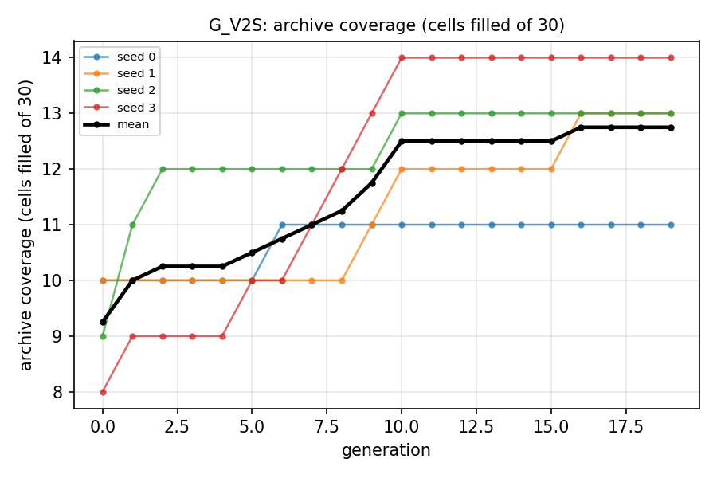

**QD-score**

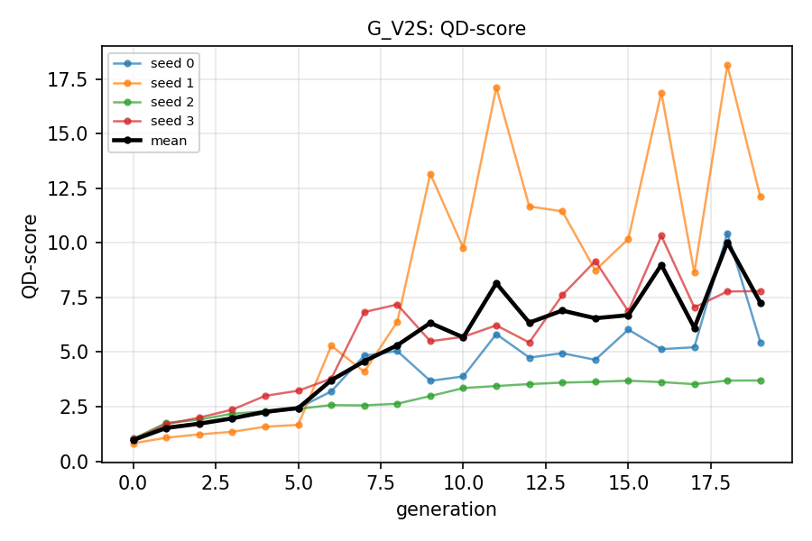

**Best and mean elite fitness**

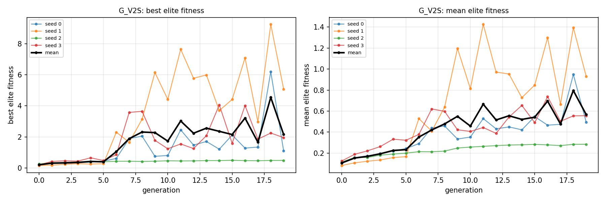

**Distinct founders and max founder share**

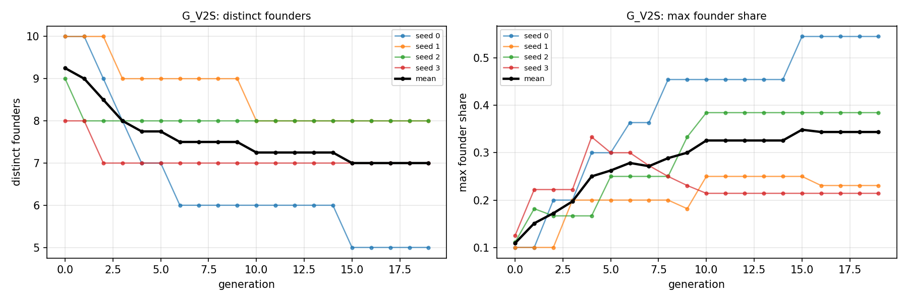

**Mean and max joint count of the elites**

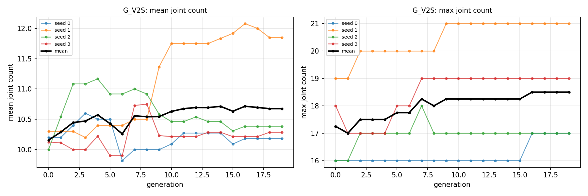

**Digit-count distribution of the elites**

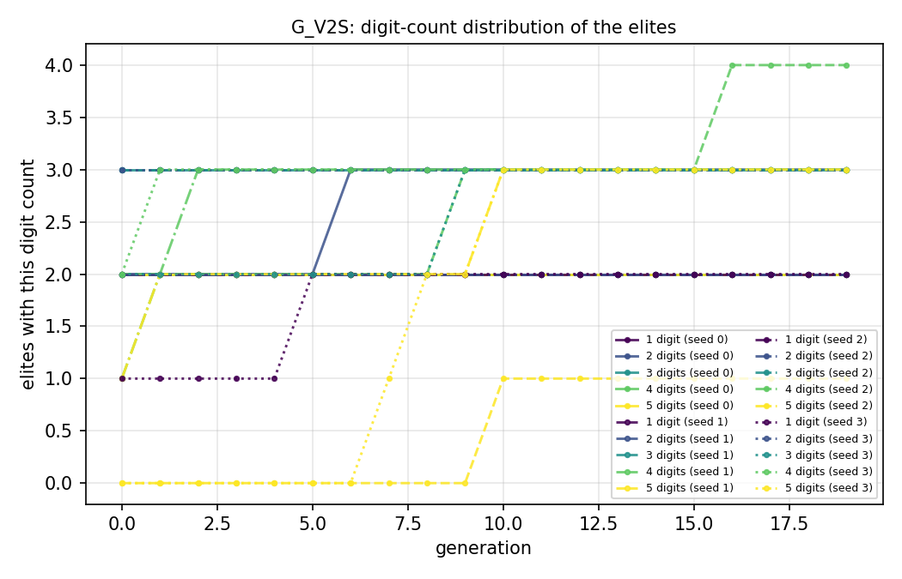

**Probe-hand fitness**

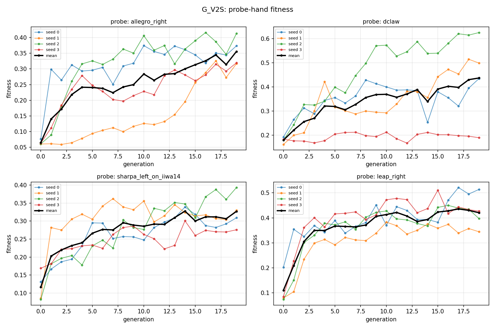

### Final-generation table

| metric | seed 0 | seed 1 | seed 2 | seed 3 | mean | range |
|---|---|---|---|---|---|---|
| final_generation | 19 | 19 | 19 | 19 | 19 | 0 |
| coverage | 11 | 13 | 13 | 14 | 12.75 | 3 |
| qd_score | 5.449 | 12.1 | 3.697 | 7.788 | 7.259 | 8.404 |
| best_fitness | 1.098 | 5.081 | 0.4807 | 1.957 | 2.154 | 4.6 |
| mean_fitness | 0.4953 | 0.9309 | 0.2844 | 0.5563 | 0.5667 | 0.6465 |
| median_fitness | 0.561 | 0.2877 | 0.2432 | 0.4755 | 0.3918 | 0.3178 |
| n_distinct_founders | 5 | 8 | 8 | 7 | 7 | 3 |
| max_founder_share | 0.5455 | 0.2308 | 0.3846 | 0.2143 | 0.3438 | 0.3312 |
| mean_joint_count | 10.18 | 11.85 | 10.38 | 10.29 | 10.67 | 1.664 |
| max_joint_count | 17 | 21 | 17 | 19 | 18.5 | 4 |
| total_wall_time_h | 9.255 | 9.25 | 9.354 | 9.351 | 9.303 | 0.1044 |
| gpu_hours_approx | 9.255 | 9.25 | 9.354 | 9.351 | 9.303 | 0.1044 |
| probe_allegro_right_fitness | 0.3736 | 0.3167 | 0.4131 | 0.3197 | 0.3558 | 0.09643 |
| probe_dclaw_fitness | 0.4346 | 0.4986 | 0.625 | 0.1897 | 0.437 | 0.4353 |
| probe_sharpa_left_on_iiwa14_fitness | 0.3092 | 0.3298 | 0.3932 | 0.2759 | 0.327 | 0.1173 |
| probe_leap_right_fitness | 0.5139 | 0.3444 | 0.3971 | 0.4268 | 0.4205 | 0.1695 |

### Final archive occupancy (heatmap)

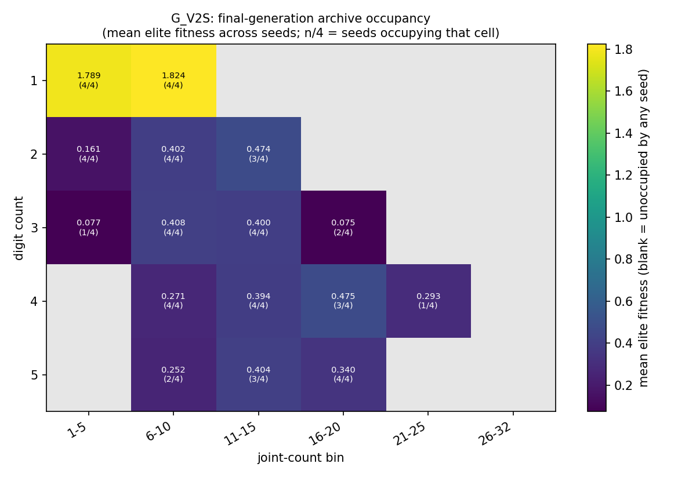

### Lineage (final archive)

**G_V2S_s0** (seed 0)

| cell | design_id | founder_id | generation_born | depth (generations) | fitness |
|---|---|---|---|---|---|
| d1_j1-5 | gen16-off-000290 | gen0-founder-000017 | 16 | 10 | 1.098 |
| d1_j6-10 | gen17-off-000308 | gen0-founder-000022 | 17 | 8 | 0.1185 |
| d2_j1-5 | gen19-off-000344 | gen0-founder-000017 | 19 | 12 | 0.1978 |
| d2_j11-15 | gen18-off-000324 | gen0-founder-000006 | 18 | 7 | 0.561 |
| d2_j6-10 | gen16-off-000300 | gen0-founder-000006 | 16 | 6 | 0.5703 |
| d3_j11-15 | gen18-off-000337 | gen0-founder-000006 | 18 | 12 | 0.6126 |
| d3_j6-10 | gen19-off-000353 | gen0-founder-000006 | 19 | 5 | 0.466 |
| d4_j11-15 | gen17-off-000307 | gen0-founder-000006 | 17 | 11 | 0.6436 |
| d4_j6-10 | gen18-off-000338 | gen0-founder-000015 | 18 | 6 | 0.241 |
| d5_j11-15 | gen19-off-000356 | gen0-founder-000006 | 19 | 13 | 0.6209 |
| d5_j16-20 | gen19-off-000346 | gen0-founder-000011 | 19 | 7 | 0.3191 |

_Depth: mean 8.82, max 13, 0/11 elites are still their own founder (depth 0)._

**G_V2S_s1** (seed 1)

| cell | design_id | founder_id | generation_born | depth (generations) | fitness |
|---|---|---|---|---|---|
| d1_j1-5 | gen18-off-000324 | gen0-founder-000004 | 18 | 4 | 4.248 |
| d1_j6-10 | gen15-off-000273 | gen0-founder-000004 | 15 | 3 | 5.081 |
| d2_j1-5 | gen13-off-000251 | gen0-founder-000018 | 13 | 3 | 0.2167 |
| d2_j11-15 | gen17-off-000311 | gen0-founder-000014 | 17 | 6 | 0.2877 |
| d2_j6-10 | gen16-off-000298 | gen0-founder-000018 | 16 | 4 | 0.2311 |
| d3_j11-15 | gen17-off-000312 | gen0-founder-000020 | 17 | 4 | 0.1872 |
| d3_j16-20 | gen19-off-000342 | gen0-founder-000027 | 19 | 8 | 0.08163 |
| d3_j6-10 | gen14-off-000268 | gen0-founder-000022 | 14 | 7 | 0.3245 |
| d4_j11-15 | gen18-off-000332 | gen0-founder-000021 | 18 | 7 | 0.2174 |
| d4_j16-20 | gen16-off-000287 | gen0-founder-000025 | 16 | 7 | 0.3529 |
| d4_j21-25 | gen15-off-000275 | gen0-founder-000025 | 15 | 6 | 0.2934 |
| d4_j6-10 | gen19-off-000333 | gen0-founder-000021 | 19 | 7 | 0.2498 |
| d5_j16-20 | gen10-off-000195 | gen0-founder-000025 | 10 | 6 | 0.3299 |

_Depth: mean 5.54, max 8, 0/13 elites are still their own founder (depth 0)._

**G_V2S_s2** (seed 2)

| cell | design_id | founder_id | generation_born | depth (generations) | fitness |
|---|---|---|---|---|---|
| d1_j1-5 | gen12-off-000219 | gen0-founder-000010 | 12 | 2 | 0.1403 |
| d1_j6-10 | gen15-off-000266 | gen0-founder-000010 | 15 | 3 | 0.1407 |
| d2_j1-5 | gen11-off-000192 | gen0-founder-000025 | 11 | 4 | 0.09975 |
| d2_j6-10 | gen19-off-000312 | gen0-founder-000003 | 19 | 6 | 0.2118 |
| d3_j11-15 | gen19-off-000317 | gen0-founder-000023 | 19 | 8 | 0.2432 |
| d3_j16-20 | gen17-off-000291 | gen0-founder-000011 | 17 | 10 | 0.06744 |
| d3_j6-10 | gen5-off-000107 | gen0-founder-000020 | 5 | 2 | 0.4352 |
| d4_j11-15 | gen17-off-000292 | gen0-founder-000020 | 17 | 7 | 0.4257 |
| d4_j16-20 | gen18-off-000304 | gen0-founder-000017 | 18 | 4 | 0.4807 |
| d4_j6-10 | gen16-off-000278 | gen0-founder-000020 | 16 | 5 | 0.441 |
| d5_j11-15 | gen9-off-000173 | gen0-founder-000020 | 9 | 5 | 0.4748 |
| d5_j16-20 | gen19-off-000323 | gen0-founder-000021 | 19 | 2 | 0.1678 |
| d5_j6-10 | gen13-off-000231 | gen0-founder-000020 | 13 | 8 | 0.3689 |

_Depth: mean 5.08, max 10, 0/13 elites are still their own founder (depth 0)._

**G_V2S_s3** (seed 3)

| cell | design_id | founder_id | generation_born | depth (generations) | fitness |
|---|---|---|---|---|---|
| d1_j1-5 | gen13-off-000249 | gen0-founder-000013 | 13 | 8 | 1.669 |
| d1_j6-10 | gen18-off-000313 | gen0-founder-000013 | 18 | 10 | 1.957 |
| d2_j1-5 | gen18-off-000314 | gen0-founder-000000 | 18 | 7 | 0.1283 |
| d2_j11-15 | gen15-off-000269 | gen0-founder-000017 | 15 | 5 | 0.574 |
| d2_j6-10 | gen18-off-000316 | gen0-founder-000017 | 18 | 7 | 0.593 |
| d3_j1-5 | gen13-off-000246 | gen0-founder-000000 | 13 | 6 | 0.07656 |
| d3_j11-15 | gen16-off-000279 | gen0-founder-000017 | 16 | 5 | 0.5553 |
| d3_j6-10 | gen10-off-000201 | gen0-founder-000021 | 10 | 5 | 0.4067 |
| d4_j11-15 | gen16-off-000285 | gen0-founder-000010 | 16 | 8 | 0.2898 |
| d4_j16-20 | gen17-off-000301 | gen0-founder-000015 | 17 | 10 | 0.5928 |
| d4_j6-10 | gen16-off-000289 | gen0-founder-000023 | 16 | 4 | 0.1513 |
| d5_j11-15 | gen15-off-000274 | gen0-founder-000023 | 15 | 7 | 0.1149 |
| d5_j16-20 | gen12-off-000225 | gen0-founder-000015 | 12 | 9 | 0.5443 |
| d5_j6-10 | gen19-off-000325 | gen0-founder-000023 | 19 | 9 | 0.1356 |

_Depth: mean 7.14, max 10, 0/14 elites are still their own founder (depth 0)._

## Variant `G_V3S` (2 seed(s): [0, 1])

### Per-generation curves

**Archive coverage (cells filled of 30)**

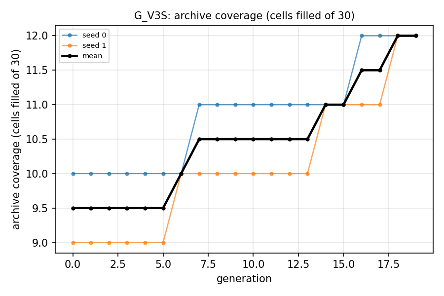

**QD-score**

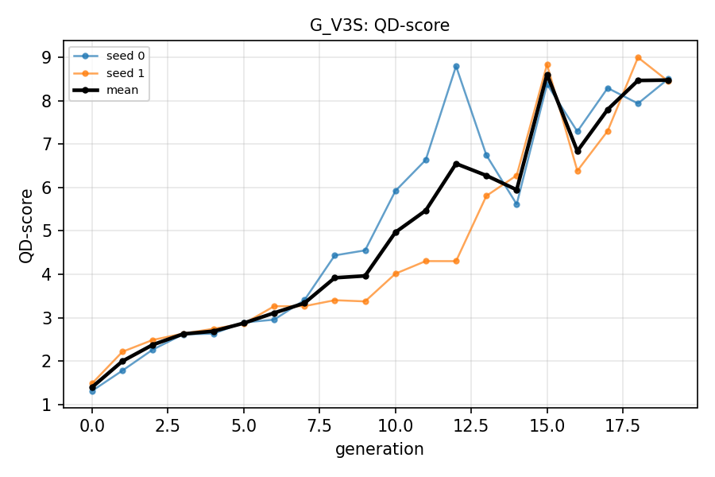

**Best and mean elite fitness**

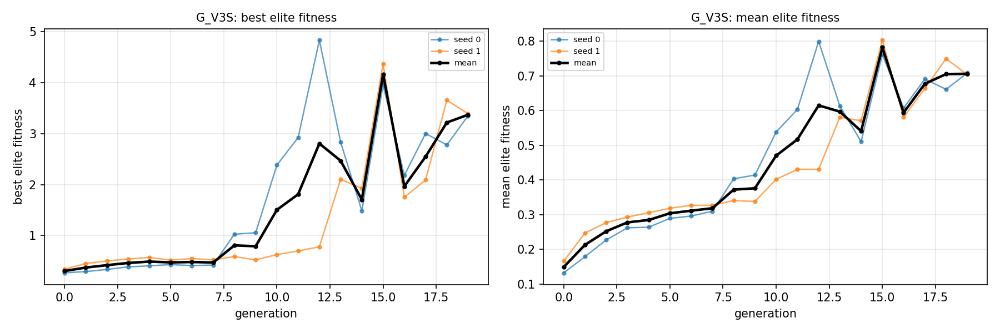

**Distinct founders and max founder share**

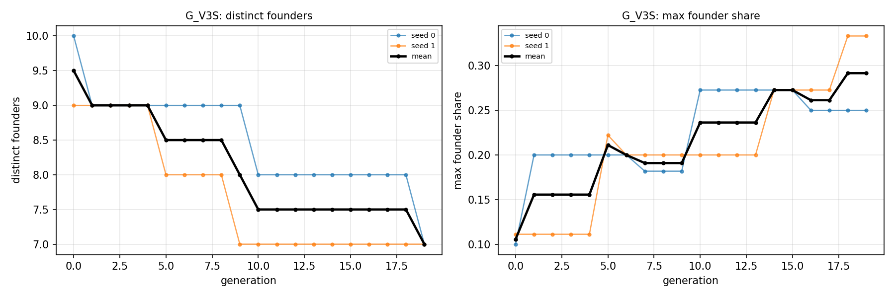

**Mean and max joint count of the elites**

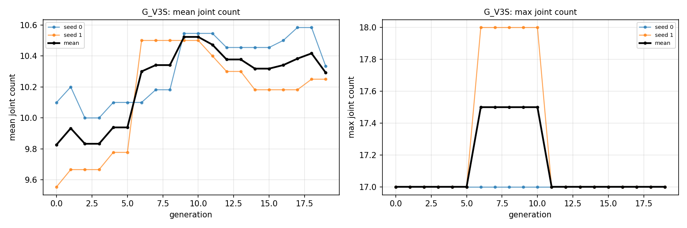

**Digit-count distribution of the elites**

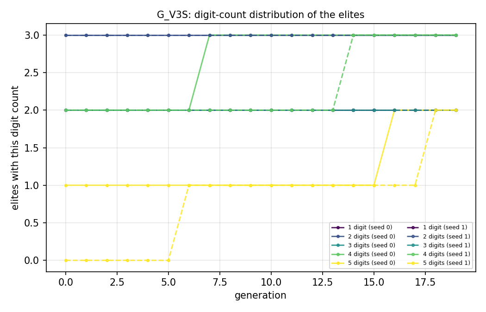

**Probe-hand fitness**

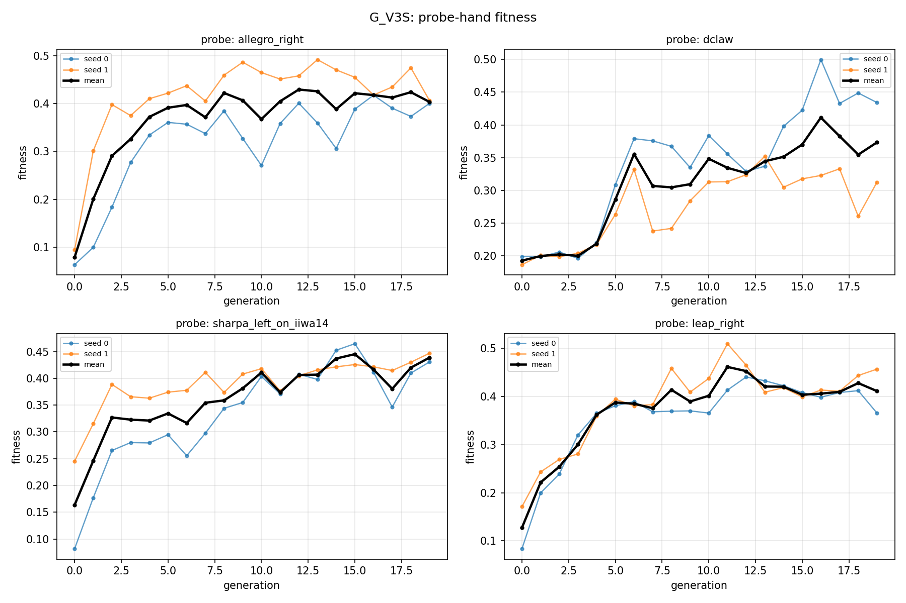

### Final-generation table

| metric | seed 0 | seed 1 | mean | range |
|---|---|---|---|---|
| final_generation | 19 | 19 | 19 | 0 |
| coverage | 12 | 12 | 12 | 0 |
| qd_score | 8.5 | 8.444 | 8.472 | 0.05673 |
| best_fitness | 3.349 | 3.394 | 3.372 | 0.0443 |
| mean_fitness | 0.7084 | 0.7036 | 0.706 | 0.004727 |
| median_fitness | 0.4976 | 0.4686 | 0.4831 | 0.029 |
| n_distinct_founders | 7 | 7 | 7 | 0 |
| max_founder_share | 0.25 | 0.3333 | 0.2917 | 0.08333 |
| mean_joint_count | 10.33 | 10.25 | 10.29 | 0.08333 |
| max_joint_count | 17 | 17 | 17 | 0 |
| total_wall_time_h | 9.287 | 9.352 | 9.32 | 0.06546 |
| gpu_hours_approx | 9.287 | 9.352 | 9.32 | 0.06546 |
| probe_allegro_right_fitness | 0.4004 | 0.406 | 0.4032 | 0.005618 |
| probe_dclaw_fitness | 0.4342 | 0.3125 | 0.3733 | 0.1217 |
| probe_sharpa_left_on_iiwa14_fitness | 0.4307 | 0.4469 | 0.4388 | 0.01625 |
| probe_leap_right_fitness | 0.3659 | 0.457 | 0.4114 | 0.09112 |

### Final archive occupancy (heatmap)

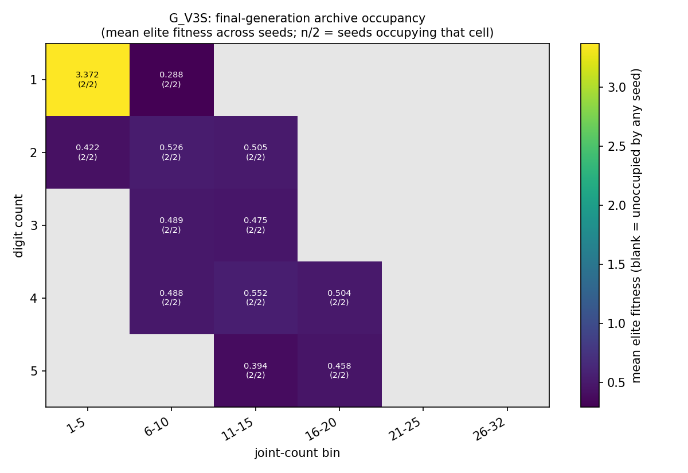

### Lineage (final archive)

**G_V3S_s0** (seed 0)

| cell | design_id | founder_id | generation_born | depth (generations) | fitness |
|---|---|---|---|---|---|
| d1_j1-5 | gen19-off-000350 | gen0-founder-000020 | 19 | 7 | 3.349 |
| d1_j6-10 | gen16-off-000294 | gen0-founder-000015 | 16 | 4 | 0.17 |
| d2_j1-5 | gen17-off-000321 | gen0-founder-000022 | 17 | 7 | 0.4962 |
| d2_j11-15 | gen15-off-000282 | gen0-founder-000000 | 15 | 5 | 0.4763 |
| d2_j6-10 | gen17-off-000307 | gen0-founder-000022 | 17 | 7 | 0.5796 |
| d3_j11-15 | gen19-off-000342 | gen0-founder-000017 | 19 | 8 | 0.368 |
| d3_j6-10 | gen19-off-000348 | gen0-founder-000022 | 19 | 8 | 0.5132 |
| d4_j11-15 | gen16-off-000295 | gen0-founder-000006 | 16 | 6 | 0.5349 |
| d4_j16-20 | gen19-off-000345 | gen0-founder-000006 | 19 | 7 | 0.5948 |
| d4_j6-10 | gen15-off-000284 | gen0-founder-000011 | 15 | 8 | 0.4736 |
| d5_j11-15 | gen19-off-000351 | gen0-founder-000011 | 19 | 11 | 0.4454 |
| d5_j16-20 | gen16-off-000291 | gen0-founder-000006 | 16 | 6 | 0.499 |

_Depth: mean 7.00, max 11, 0/12 elites are still their own founder (depth 0)._

**G_V3S_s1** (seed 1)

| cell | design_id | founder_id | generation_born | depth (generations) | fitness |
|---|---|---|---|---|---|
| d1_j1-5 | gen15-off-000290 | gen0-founder-000024 | 15 | 5 | 3.394 |
| d1_j6-10 | gen17-off-000322 | gen0-founder-000004 | 17 | 8 | 0.406 |
| d2_j1-5 | gen15-off-000298 | gen0-founder-000025 | 15 | 7 | 0.3471 |
| d2_j11-15 | gen14-off-000269 | gen0-founder-000010 | 14 | 8 | 0.5337 |
| d2_j6-10 | gen15-off-000287 | gen0-founder-000027 | 15 | 5 | 0.473 |
| d3_j11-15 | gen18-off-000353 | gen0-founder-000023 | 18 | 9 | 0.5812 |
| d3_j6-10 | gen13-off-000259 | gen0-founder-000027 | 13 | 4 | 0.4643 |
| d4_j11-15 | gen14-off-000274 | gen0-founder-000023 | 14 | 6 | 0.5685 |
| d4_j16-20 | gen14-off-000279 | gen0-founder-000016 | 14 | 7 | 0.4138 |
| d4_j6-10 | gen16-off-000316 | gen0-founder-000027 | 16 | 6 | 0.5024 |
| d5_j11-15 | gen18-off-000348 | gen0-founder-000027 | 18 | 7 | 0.3425 |
| d5_j16-20 | gen16-off-000309 | gen0-founder-000016 | 16 | 9 | 0.4175 |

_Depth: mean 6.75, max 9, 0/12 elites are still their own founder (depth 0)._
