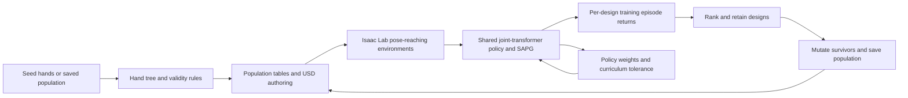
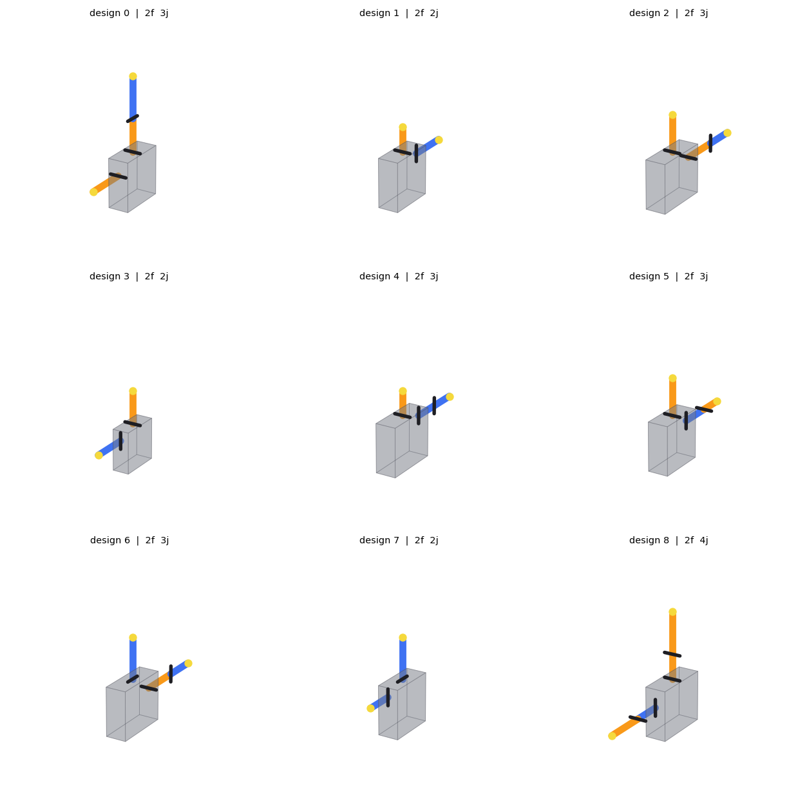

**Project investigation for Martin Peticco, 21 September 2026**

The most useful starting contribution is to make the hand search measurable over its actual 40-generation budget: quantify what mutations change, which designs remain reachable, how morphological diversity develops, and what physical constraints the representation omits. This directly addresses the assignments to Martin in the Notion notes. Before attributing performance differences to the grammar, the team should investigate a reproduced interaction between observation normalization and joint masking in the policy.

This review is anchored to local `master` commit `8d1395320f7027ccd088ba5593bde50a69eecf65` (18 September). The working branch is `codex/martin-hand-sampler`, created from that commit. Investigation notes and artifacts are stored outside the Git repository in `project-notes/investigation-2026-09-21`; the repository working tree is clean and production behavior was not changed. Remote-tracking refs were inspected as present locally, without fetching. Findings about historical runs are identified as reported results because the populations, checkpoints, and raw training logs are absent from this checkout.

**What the project is trying to establish.**

The Notion overview and August 28 discussion propose a bilevel problem: learn control on a training distribution, then improve hardware for performance under distribution shift. The intended outputs are an open-source hand and an algorithm for co-evolving morphology and control. The current task is grasping a tool-like object from a table and moving it through sequences of SE(3) goals. The success criterion uses object keypoint distance, with a curriculum tightening from 0.075 m to 0.01 m; those numbers are not independent translational and angular thresholds.

There are three distinct claims to test: evolving the training population helps a shared controller learn; the resulting hardware is better under comparable training; and the hardware retains performance on unseen conditions. Current evidence supports investigating the first claim. It does not yet establish all three. The active selection loop ranks training episode return, so held-out hardware generalization remains an objective to implement and evaluate.

The strongest hardware comparison would train selected evolved hands and reference hands from scratch with matched budgets, then evaluate all of them at fixed tolerances on the same objects, goals, and perturbations. A shared controller can favor designs it has seen most often. Its ranking is therefore a joint property of hardware and training history.

**The comments directed at Martin.**

The source is the 25-page Notion PDF exported on 21 September, last edited by Martin Peticco. The supplied file named `Evolve To Generalize.pdf` is a ZIP archive containing that PDF and media. A byte-preserving extraction of the actual PDF is available at `../../reference/Evolve to Generalize - Notion export.pdf`. The export contains inline meeting notes and mentions; it does not reliably identify the author of every untagged comment. Those comments should be treated as team discussion, not automatically attributed to Martin.

| Source | Assignment or discussion | Practical interpretation for Martin |
|---|---|---|
| pp. 3–4, September 18 | Martin and Vatsal tagged to deliberately diversify evaluation objects; look at Visual Dexterity objects | Define which shape and physical properties are missing from the current tool pool, and propose controlled additions |
| p. 9 | Martin tagged on whether pose reaching/reorientation is sufficiently general; consider interaction, power grasps, more shapes; keep simulation manageable | Specify what capability each task measures and whether the arm can solve it while the hand maintains a static grasp |
| pp. 9–10 | Martin and Vatsal tagged to rethink grammar and mutations assuming 40 generations | Audit mutation scale, locality, coverage, physical realizability, and discrete versus continuous parameters |
| pp. 5–6 | Lineage collapse need not imply morphological collapse; mutation size should be tunable | Separate ancestry statistics from geometric and behavioral distances; measure actual parent–child changes |
| pp. 8–9 | Complexity, mass, energy, distance between hands, simple initialization, complexity penalties | Log a performance–complexity archive and distinguish motor count, simulated mass, and measured energy |
| pp. 5, 9, 12 | SHARPA transfer through training; inject SHARPA; reset policy; adjust selection; random immigrants; lexicase/multiobjective ideas | Turn these into separate ablations with matched budgets and explicit hypotheses |

The instruction to branch from `master` and work in `hand_sampler` gives a clear implementation boundary. Object authoring and RL changes live elsewhere and need coordination, although understanding them is necessary to interpret search results. The initial modular-grammar assignment to Vatsal and policy assignment to Kushal are explicit in the August 28 notes (p. 23); they are useful historical context, not a complete current ownership chart.

**How the full repository fits together.**



| Area | What it does now | Why it matters to this work |
|---|---|---|
| [`design_space.py`](../../gen_mechanics/hand_sampler/design_space.py), [`gen_init_pop.py`](../../gen_mechanics/hand_sampler/gen_init_pop.py) | Frozen `Hand/Palm/Finger/Mount/Segment/Joint` data, kinematics, tokens, seed sampling | Defines the representable and initially reachable hands |
| [`mutate_design.py`](../../gen_mechanics/hand_sampler/mutate_design.py), [`validate_design.py`](../../gen_mechanics/hand_sampler/validate_design.py) | Nine mutations; geometric and grammar validity | Main implementation surface for Martin |
| [`population_io.py`](../../gen_mechanics/hand_sampler/population_io.py), [`robot_spec.py`](../../gen_mechanics/hand_sampler/robot_spec.py) | Saved genotypes, provenance, padded geometry/limit tables, design and object assignment | Interface between search and training; preserve population identity |
| [`build.py`](../../gen_mechanics/hand_sampler/build.py), [`robot_param_constants.py`](../../gen_mechanics/hand_sampler/robot_param_constants.py) | Direct USD authoring, mass/inertia, actuator defaults, collision filters; URDF output for viewing | Geometry changes must agree with what the simulator and policy observe |
| [`evolve.py`](../../gen_mechanics/hand_sampler/evolve.py) | Training-return ranking, elitism, mutation/refill, ancestry records | Selection experiments and lineage accounting |
| [`drift.py`](../../gen_mechanics/hand_sampler/drift.py), [`experiments/`](../../gen_mechanics/hand_sampler/experiments/README.md) | Independent neutral walks; separate resumable population experiments | Existing machinery for measuring the grammar prior |
| [`viewer.py`](../../gen_mechanics/hand_sampler/viewer.py), [`sharpa_capsule.py`](../../gen_mechanics/hand_sampler/sharpa_capsule.py) | Interactive/static hand views; grammar-compatible SHARPA approximation | Visual review and a reference design using the generated-hand path |
| [`isaacsimenvs/pose_reaching_6d`](../../gen_mechanics/isaacsimenvs/pose_reaching_6d/env.py) | Scene construction, resets, actions, observations, rewards, curriculum | Determines what a design is actually rewarded for |
| [`coevolution/train.py`](../../gen_mechanics/coevolution/train.py), [`joint_transformer.py`](../../gen_mechanics/coevolution/networks/joint_transformer.py) | Isaac startup and RL training; per-joint shared policy | Controls transfer, exposure bias, and the masking issue below |
| [`design_rewards.py`](../../gen_mechanics/coevolution/design_rewards.py), [`eval/`](../../gen_mechanics/coevolution/eval/suites.py) | Per-design training statistics; held-out condition definitions and policy playback | Training scores and generalization evaluation are separate paths |
| [`experiments/17sep_coevolution`](../../gen_mechanics/experiments/17sep_coevolution/README.md) | Current V2 launch scripts; calls the scaling-laws runner | Source of effective experiment settings |
| `experiments/decentralized_control` | Architecture/throughput studies and SHARPA finger-dropout evaluation | Reference controller experiments and checkpoint remapping |
| `third_party/rl_games` | Vendored SAPG fork | Its normalization and checkpoint behavior affect the custom transformer |
| `assets`, `debug_outputs` | Robot meshes and placeholders for generated populations and runs | Clone contains reference assets, but not the data needed to reproduce published curves |

The README's dependency direction is an architectural intention with exceptions: `hand_sampler.evolve.main` imports the reward merger, the viewer imports `coevolution.pose_viewer`, and USD authoring imports simulator-side helpers. Core sampling and mutation are CPU-friendly. The complete folder is not dependency-free.

**The current grammar and its search consequences.**

Generated hands have 2–5 fingers and 1–6 joints per finger, giving 2–30 independently actuated joints. Each finger is a serial chain; the current `Finger.segments` representation does not support branching. Seeds have two fingers on adjacent face pairs (`+y/+z` or `-y/+z`) and 2–4 joints total. They start with zero offsets and flexion/abduction axes.

| Parameter | Current implementation |
|---|---|
| Palm | Thickness 15–40 mm, width/length 40–100 mm on a 5 mm grid; width/length mutate by 10 mm |
| Seed palm thickness | 20 or 25 mm; never mutated, so the nominal thickness range is not all reachable from these seeds |
| Mounts | Three thin faces (`+z`, `+y`, `-y`); normalized coordinates; movement nominally 5 mm, with face crossings |
| Links | Length 15–80 mm in 5 mm increments; six-link fingers can nominally total 480 mm before geometric filtering |
| Joint axis | Theta on a 15° grid in `[0, 180°)`; phi fixed at 90° |
| Rest offset and travel | Offset in `[-90°, 90°]` on the angle grid; actuated travel also ±90° |
| Structural mutations | Split/merge links; add/remove a single-joint finger; each changes joint count by one |
| Parameter mutations | Axis, offset, and length perturb every joint/link; mount movement changes one finger; palm mutation changes one dimension |
| Generated actuation | Uniform 1 Nm effort ceiling and 10 rad/s velocity ceiling; fixed gains/armature |



The first nine designs from `gen_s0_n64`, rendered with the existing viewer. These are initial seeds, before neutral drift or reward-based evolution. Black bars indicate joint axes.

These choices are the search prior. A split is possible only above twice the link-length floor; removing a finger requires first reducing it to one joint. Operator pairs having opposite names does not imply equal transition probabilities. `evolve.mutate_once` retries up to 64 operator draws until a valid child is found, whereas `drift_round` retains the parent after a failed proposal. The resumable `experiments.run` also has resampling and a different replacement scheme. Their neutral distributions and effective mutation budgets should not be assumed identical.

The discretization question is mixed: angles and lengths are quantized, while seed mount coordinates include continuous draws. Discreteness alone is not a locality guarantee. In particular, changing every angle at once and wrapping an axis with a nonzero offset can produce large geometric changes.

The validator checks bounds, grids, counts, mount spacing, and nonadjacent link collisions at rest. It does not certify motor packaging, transmissions, cable routing, thermal limits, strength, manufacturability, or collision-free motion across the joint range. Adjacent links and each finger's first link against the palm have filtered collisions. Simulated mass is derived from simple geometry and density, without an explicit motor/transmission bill of materials. Physical realizability needs an explicit scope beyond passing `is_valid`.

Every generated hand occupies a fixed 5×6 hand-joint envelope plus seven arm joints. Unused joints are almost locked, have negligible mass and no colliders, and are intended to be masked from policy attention and pooling. The policy uses 32 values per hand-joint token: five proprioceptive/action-history scalars, 12 ordered link-box coordinates, three limit/existence values, and 12 object-relative keypoint coordinates. It uses full attention and a shared hand action head; arm actions use a separate head. This is shared per-joint control, not isolated agents or graph-restricted communication. The padding cost remains even for simple hands.

**What the current experiments actually run.**

V1 uses 1,024 designs initialized after 500 neutral mutation rounds, 24,576 environments, a d64/L4 transformer, 2,000 epochs between selection events, and top-512 survival. Survivors remain unchanged and each has one child. The policy weights and scalar curriculum tolerance carry forward; `--checkpoint_load_mode weights` starts a new training process rather than restoring the complete optimizer/rollout state. The fixed-population baseline restarts on longer links. Restart cadence is therefore an additional comparison variable.

V2 (`17sep_coevolution`) raises the generation budget to 5,000 epochs, adds palm observations, expresses geometry from the end effector in metres, and gives each design the same curated set of 24 objects through `design_cycle`. Two ranks each run 12,288 environments. The pool is deliberately diverse within six tool categories and 12 size distributions, with small and large examples. These are in-distribution examples relative to the earlier procedural ranges, not a new held-out shape benchmark.

The effective runner also uses privileged state as the actor observation (`obs_list=state_list`), disables the separate central critic, disables the configured observation/action delays and disturbance forces, and removes action smoothing. Reading only the base YAML would miss these changes. Current V2 defaults still retain 512 designs and rank `return_mean`.

The reward table accumulates completed episodes throughout a generation. It is not a separate evaluation of the final frozen policy. It pools across changing policy competence and potentially changing curriculum tolerance. Identical object coverage also does not ensure equal object weighting: with episode-weighted aggregation, short episodes can contribute more observations of particular objects. It contains no per-object score matrix for lexicase selection. Return includes fingertip shaping summed across fingers and joint-velocity penalties summed across joints; motor count, grasp geometry, and episode duration can all affect ranking independently of the intended held-out task score.

The September 18 notes and V1 README report reaching 1 cm tolerance by generation 31, versus 2.9 cm for the fixed population after about 66k epochs; mean joints increased from about 11.2 to 18.1. These are training results from the recorded setup. The notes' “imitation” comparison means manually reproducing SHARPA morphology with grammar primitives, followed by RL. It does not describe behavior-cloning demonstrations. The capsule reference has 21 joints versus the real hand's 22 and changes mounting, spacing, axes, geometry, and actuation.

**Findings reproduced during this investigation.**

Reproductions are in [`reproduce_findings.py`](reproduce_findings.py), with captured output and dependency versions in [`evidence.json`](evidence.json). They are CPU probes, not newly measured robot performance.

| Priority | Finding and evidence | Implication |
|---|---|---|
| Investigate before interpreting new RL runs | [`joint_transformer.py:453`](../../gen_mechanics/coevolution/networks/joint_transformer.py#L453) thresholds `joint_enabled > 0.5` after the vendored model normalizes observations. Both configured normalization and this threshold are active. Feeding 4,096 rows of enabled joints through the actual normalizer gives approximately 0.01094; the actual transformer trunk then masks all three probe joints | Preserve existence information before normalization or explicitly exempt those columns. Verify actor and critic paths with an end-to-end regression. Quantifying effects on historical runs needs their checkpoints and statistics |
| Before mutation-scale conclusions | [`perturb_axis`](../../gen_mechanics/hand_sampler/mutate_design.py#L223) wraps theta modulo π without changing offset sign. For a valid two-finger hand with a 50 mm link and 60° offset, 150°→165° moves the tip 11.30 mm; 165°→0° moves it 85.86 mm. The unwrapped 165°→180° move is again 11.30 mm | Revisit axis/offset canonicalization. An axis sign flip must be handled consistently with rest offsets and joint-coordinate semantics; do not label every grid step equally local |
| Before trying `KEEP=768` | [`next_generation`](../../gen_mechanics/hand_sampler/evolve.py#L52) creates a child for every survivor, then truncates the population without truncating child records. With N=8 and keep=6, there are two actual children but six child records | The default half-survival case is unaffected. Higher survivor fractions produce misleading ancestry metadata, and only the leading survivors' children survive truncation |
| At the population input boundary | [`load_population`](../../gen_mechanics/hand_sampler/population_io.py#L152) checks format/count and dataclass construction, but does not call the grammar validator. A 123 mm palm loads successfully and is then rejected by `validate_design.check` | Establish explicit validation for generated populations. Imported measured hands intentionally exceed the generated grammar, so a blanket check needs a declared population type |
| Geometry consistency | Grammar/validator/token radius is 10 mm; the authored collider radius is approximately 10.1657 mm from the measured SHARPA proximal tier | Small but real mismatch. Consolidate the physical convention before calibrating clearances or changing link size |

For the normalization finding, the probe directly calls `BaseModelNetwork.norm_obs` and `JointTransformerNet._trunk` with minimal layout metadata to avoid an Isaac import. It does not instantiate a full training job. The running normalization formula and the current YAML/runner confirm the integration risk; the impact on any particular published checkpoint remains unmeasured. Constant enabled columns approach zero after normalization, and even varying enabled columns can cross the mask threshold as their prevalence changes. Existing attention-mask unit tests supply Boolean masks directly and do not exercise this path.

Additional inspection findings: `coevolution/population/run_config.py` omits newer `object_pool`, `object_assignment`, and `obs.geometry_origin` fields from `RUN_FIELDS`. Callers must compensate when reconstructing V2 evaluation. Its list also contains older population fields absent from the current config class. `experiments.stats.topology` sorts face labels and joint counts independently, discarding which chain depth belongs to which face, so its diversity statistic is coarse. Neither the existing distinct-genotype count nor ancestor count measures geometric distance.

**Useful evidence is outside master.**

The only locally known commit not reachable from master is `a0cabda` on `origin/2026-09-18-analyze_results`. It adds `experiments/10sep_coevolution/analysis/`, including lineage, phylogeny, trait, reward, tolerance, object, and policy-rendering scripts. Inspect it before rewriting that work:

```bash
git show origin/2026-09-18-analyze_results:experiments/10sep_coevolution/analysis/README.md
git diff --stat master origin/2026-09-18-analyze_results
```

That branch's README reports complete ancestry convergence on founder #521 by generation 13, initial-to-eventual score correlation 0.21, and loss of the baseline's eventual best design (#933) at generation 1 when its return was 272 versus a median of 276. It also asserts that mutation was not the bottleneck, citing roughly equal operator frequencies and late parent–child score correlation near 0.15. These are useful hypotheses and reported analyses, not conclusions re-established here. Equal operator frequencies do not establish equal geometric coverage. Low score correlation is also affected by policy noise and evaluation protocol.

Several scripts depend on cluster paths and an external `_style` module. Their presence does not make their figures reproducible from this checkout alone. The chart loader blanks 200 epochs after process restarts and converts epochs to wall time using an estimated 5.5 seconds per epoch; plots should disclose those choices. The lineage plotting code also has an annotation risk: it sorts founders with the survivor first but labels `top[-1]`, which can name an extinct lineage as fixed. Prefer the ancestry counts when resolving conflicting labels.

**Documentation that would mislead onboarding.**

The top-level README lists removed modules (`params.py`, `population.py`, `minimal/`, `gates/`) and uses the obsolete `python -m hand_sampler.population` quick start. Use `population_io` for saved seed populations. `DESIGN.md` says the builder and policy interface do not exist, but both are implemented. It describes proximal-only collision checks, while the validator now checks all nonadjacent links at rest. Its final open questions mention a 7×6 envelope, whereas current constants are 5×6. The experiments README reports historical 42-joint results that cannot be reproduced under today's 30-joint cap.

Treat historical measurement-based restrictions as conditional evidence. For example, the old radius result came from an undertrained policy and a different parameterization. The deleted `docs/analysis.md` is recoverable with `git show 36c8be5:docs/analysis.md`: it explicitly states that all 24,576 designs were evaluated for 10 episodes each at 3 cm tolerance, with a single fixed object per design and a checkpoint at 14% of its training budget. That supports revisiting the restriction under a new task distribution; it does not establish that radius never matters.

The notes also disagree on elapsed time for a 12,000-epoch baseline (12 versus 90 hours). Use saved configs, step counts, and logs for quantitative comparisons. Old experiment scripts are explicitly archived and some target removed modules.

**The literature linked to your comments.**

The “paper” link beside the lineage/diversity comment is Strgar and Kriegman's [Accelerated co-design of robots through morphological pretraining, ICLR 2026](https://proceedings.iclr.cc/paper_files/paper/2026/hash/0cfeabacfcdf49ce45826a2f7eb89a3c-Abstract-Conference.html). Figure 6 and Sections 3.2–3.3 measure diversity using mean pairwise normalized genotype Hamming distance, separately from performance, across three trials. Their study distinguishes simultaneous co-design, evolution with a frozen pretrained controller, and generational fine-tuning from the pretrained controller. This motivates testing controller history separately from selection in this project. Their soft voxel robots, differentiable simulation, and genotype metric differ from articulated hands; the results are not direct evidence that the same intervention will work here.

The likely reference behind “Visual Dexterity objects” is [Chen et al., Visual Dexterity](https://taochenshh.github.io/projects/visual-dexterity), which evaluates reorientation of novel complex shapes and explicitly reports failures as well as successes. Use its shape diversity as a starting point for a hand-relevant object taxonomy, then control scale, mass, friction, collision complexity, and grasp affordances. The notes do not identify a particular asset subset.

[RoboGrammar](https://people.csail.mit.edu/jiex/papers/robogrammar/index.html) is particularly relevant to representing fabricable assemblies. Its original publication is TOG/SIGGRAPH Asia 2020; the ICRA 2021 citation in the notes likely refers to the follow-up multiobjective graph-search work. [Pathak et al., NeurIPS 2019](https://papers.nips.cc/paper_files/paper/2019/hash/c26820b8a4c1b3c2aa868d6d57e14a79-Abstract.html) already studies morphology-linked modular control and test-time generalization. Novelty claims should therefore be specific about dexterous hands, the evaluation split, and the co-design method.

**A concrete first work package within hand_sampler.**

1. Establish the evidence baseline. Preserve exact starting populations and provenance. Obtain V1/V2 population snapshots, `selection.json`, reward tables, saved configs, and checkpoints from the team. Use the unmerged analysis scripts as references. Share the normalization reproduction with the policy owner before spending a new GPU budget; no messages were sent during this investigation.
2. Add a CPU mutation audit over exactly 40 rounds, using both simple seeds and the saved round-500 population. Compare single-draw neutral walks, the current retry-until-valid operator mixture, and the actual survivor/child replacement rule. Run several seeds and report proposal success, null copies, achieved operator frequency, changed joints, reach/mass changes, and geometric displacement.
3. Define separate diversity measures: founder entropy/effective ancestor count; permutation-aware topology; geometry after aligning the palm and matching fingers; and, once rollouts are available, per-object performance profiles. Start with distributions rather than one composite distance. Pair face identity with chain structure, and use axial circular statistics for theta rather than ordinary angle means.
4. Fix axis/offset locality and selection bookkeeping before interpreting sweeps. Then expose parameter step size, per-joint versus whole-hand scope, and number of mutation operations as independent controls. Keep the envelope fixed for the first experiments so policy dimensions and simulation cost remain comparable. Mutation schedules should record their settings in population provenance.
5. Evaluate one physically constrained variant alongside the exploratory grammar. Define actual joint modules, minimum housing/assembly distances, travel, torque and mass assumptions. Use the SHARPA capsule deviations as concrete examples of what the current grammar cannot represent. Do not equate stronger geometric bounds with a manufacturable design without specifying the hardware.
6. Log a performance–motor-count archive before choosing a penalty. Simulated mass can be computed from existing builders; energy needs trajectories and an explicit mechanical/electrical definition. Compare any complexity penalty against a Pareto archive or per-complexity allocation, since an arbitrary scalar weight can predetermine the answer.

The first deliverable should answer: how much useful variation does one generation create, how much diversity survives 40 generations, and which constraints exclude reference-quality designs? It should include reproducible diagnostics and representative hand renders. Rewriting the grammar before those measurements risks changing several causes at once.

**Experiments to coordinate with the rest of the team.**

| Experiment | Main question | Control needed |
|---|---|---|
| Simple seeds versus round-500 initialization | Does neutral pre-drift undermine the intended simple-to-complex curriculum? | Same search/controller budget, multiple seeds, same object assignment |
| Pretrained versus scratch shared controller | Does early selection discard good hardware before the policy can use it? | Count pretraining in total compute; use matched starting populations |
| Keep 50% versus 75% versus immigrant/niche variant | Does reduced truncation pressure preserve useful alternatives? | Fix record bug first; explicitly state survivors, offspring, and immigrant counts |
| Small versus larger/local versus whole-hand mutations | Is the 40-generation search limited by coverage or disrupted by poor locality? | Same grammar, proposal accounting, validity checks and control budget |
| Cross-evaluate final policies on both populations | Did hardware improve or did the controller specialize to its evolving population? | Fixed success tolerance and identical evaluation conditions |
| Train best evolved, capsule SHARPA, and real SHARPA from scratch | Is there a hardware advantage or faster learnability? | Equal gradient/environment-step budgets; disclose geometry and actuator differences |
| Track SHARPA transfer through generations | Does exposure to the selected population reduce transfer? | Checkpoint remapping and normalization consistency; capsule SHARPA is easier to compare within the existing envelope |

Clarify the meeting phrase “reduce selection rate to 25%”: keeping 25% increases truncation pressure, while replacing 25% means keeping 75%. The code's `KEEP` is a survivor count. These are materially different experiments.

To test generalization, maintain three distinct data roles: policy training, design-selection validation, and a final untouched test set. Repeatedly choosing hardware using a “held-out” set makes that set part of the design optimization process. Report absolute held-out performance alongside retention, since ratios can look favorable for weak nominal performers. Fix tolerance and rollout budgets when comparing methods.

For object/task extensions, a first proposal can stay in `hand_sampler` documentation while simulator changes are coordinated. Cover thin and broad grasps, round objects, offset centers of mass, asymmetry, and varied cross-sections before adding many assets. Then add a controlled interaction such as constrained insertion or sustained contact. Measure object rotation relative to the palm to determine whether reorientation requires finger motion rather than arm transport. New meshes also need an explicit policy geometry representation; the present object observations are based on a small keypoint description.

**Validation and a practical starting session.**

The investigation ran on macOS in a temporary Python 3.14 environment, not the project's pinned Python 3.11/Isaac/CUDA stack. All 126 existing `hand_sampler` tests passed, with seven gimbal-lock warnings from rotation conversion. The network-mask and simulator-surface checks contributed another 29 passing tests, giving 155 existing tests passed in total. One static-check test initially failed because `pyflakes` was missing; it passed after installing that dependency. No simulator training, GPU evaluation, physical experiment, or checkpoint transfer was run.

The temporary environment is `/tmp/evolve-hand-audit-venv`. It can run the saved probes from the repository root:

```bash
/tmp/evolve-hand-audit-venv/bin/python ../project-notes/investigation-2026-09-21/reproduce_findings.py
```

For a durable project environment, follow the repository's Python 3.11 and exact Isaac/PyTorch installation pins on the training machine. The CPU audit environment is only a validation convenience. Do not substitute its versions into the training recipe.

Useful first commands, after setting `PY` to the appropriate environment, are:

```bash
# Run from gen_mechanics/.
PY=/tmp/evolve-hand-audit-venv/bin/python
$PY -m hand_sampler.population_io gen_s0_n64 --out /tmp/martin-seeds.json
$PY -m hand_sampler.viewer png --population /tmp/martin-seeds.json --designs 0-8 --out /tmp/martin-seeds.png
$PY -m pytest hand_sampler/tests -q
```

The generation and PNG-viewer commands above were also run successfully. Core generation can run locally. Full co-evolution needs the Linux/NVIDIA Isaac environment and cluster configuration; the committed scripts contain Kushal's filesystem paths, SLURM resources, and W&B account settings. The local `/usr/bin/git` and `/usr/bin/python3` launcher path also encounters an Xcode library error; explicit Homebrew executables worked for this review.

Coverage: inventoried all repository areas and locally available branches; traced the active generation-to-training-to-selection path and relevant vendored RL code; inspected all 25 PDF pages and their charts; sampled frames from ten exported videos; checked the linked diversity paper and relevant primary literature. The linked Notion “Prior Works” subpage and card contents are not included in this export. Four larger video attachments were inventoried but not played. Missing experimental data prevents independent confirmation of the historical numerical results. No code was committed or pushed.
